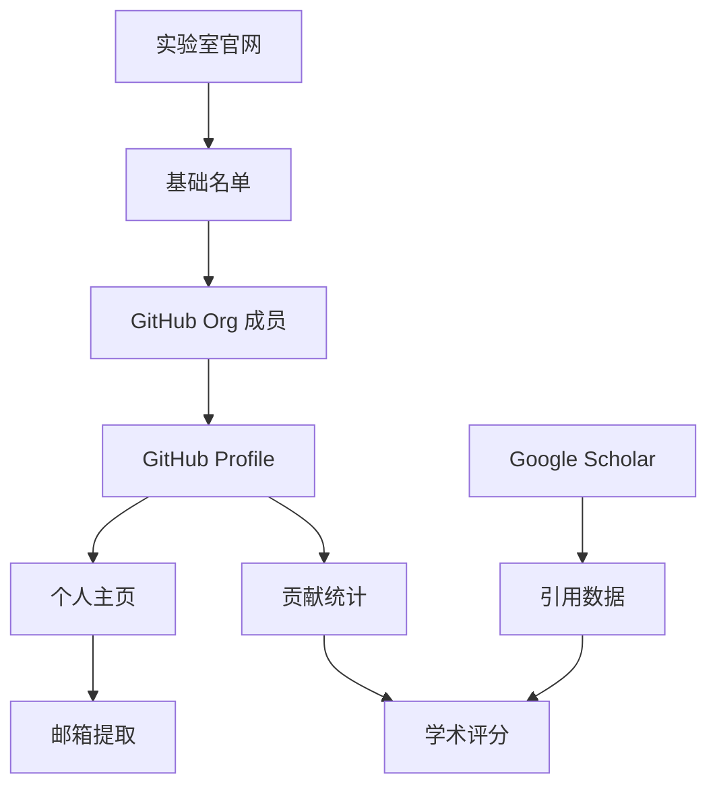
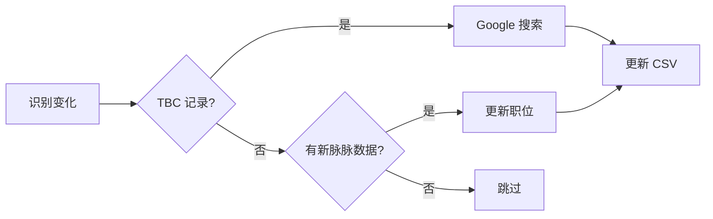

# 教授学生信息搜源 - Skills 文档

## 概述

本文档总结了从学术实验室搜源学生信息的完整流程，包括遇到的问题和解决方案。

---

## 🔄 完整流程



### Phase 1: 基础信息采集
1. 搜索实验室官网 (如 `uav.hkust.edu.hk`)
2. 解析 Current Members 和 Alumni 页面
3. 提取姓名、毕业年份、论文题目

### Phase 2: GitHub 组织分析
1. 访问 GitHub org (如 `github.com/orgs/HKUST-Aerial-Robotics/people`)
2. 记录所有成员的 GitHub 用户名
3. 与官网名单交叉验证，发现遗漏人员

### Phase 3: GitHub Profile 深度提取
1. **逐个访问** 每个成员的 GitHub Profile
2. 提取：邮箱、个人主页链接、followers、contributions、stars
3. 跟进个人主页提取更多信息

### Phase 4: 学术数据收集
1. 搜索 Google Scholar 获取引用数
2. 统计 GitHub Stars 和 Contributions
3. 计算综合学术评分

### Phase 5: 脉脉/LinkedIn 职业验证 🆕
1. 在脉脉搜索学生姓名
2. 核实当前公司和职位
3. 更新 current_position 和 current_company
4. 记录数据来源为 `maimai` 或 `linkedin`

**脉脉数据解析示例**:
```
输入: 王凯旋 感知算法工程师 卓驭 2023.1-至今 (3年) 自动驾驶

解析:
- current_position: 感知算法工程师
- current_company: 卓驭(ZYT)
- research_direction: 自动驾驶
- 工作年限: 3年 (可推算毕业时间)
```

### Phase 6: Google 搜索批量更新 🆕
1. 识别 TBC 或信息不完整的记录
2. 使用 `search_web` 批量搜索
3. 提取最新职位、单位、论文成果
4. 更新 CSV 并标记数据来源

**Google 搜索关键词模板**:
```
"{中文名} {英文名} HKUST {研究方向关键词}"
"{英文名} {实验室名} {毕业年份} current position"
"{中文名} {研究方向} PhD thesis defense"
```

**搜索结果解析要点**:
1. 优先信任 `.edu` 和 `.edu.hk` 域名的信息
2. 核对论文答辩公告确认毕业时间
3. 从 Google Scholar 主页获取最新 affiliation

---

## 📋 详细信息提取策略

除了基础联系方式，以下字段对于人才评估非常重要：

### 1. 本科院校 (Undergraduate University)

**信息来源优先级**:
| 来源 | 可靠性 | 提取方法 |
|------|--------|----------|
| 个人主页 "About/Bio" | ⭐⭐⭐⭐⭐ | 通常明确写出 "B.Eng from Zhejiang University" |
| LinkedIn Education | ⭐⭐⭐⭐⭐ | 完整学历时间线 |
| 实验室成员介绍 | ⭐⭐⭐⭐ | 部分实验室会列出学生本科背景 |
| 论文作者信息 | ⭐⭐⭐ | 早期论文可能标注本科单位 |
| Google Scholar | ⭐⭐⭐ | 部分用户填写 Education |

**提取示例**:
```
# GitHub Bio 或个人主页常见格式
"PhD student at HKUST, B.Eng from HIT"
"Ph.D. candidate, supervised by Prof. Shen. Previously from ZJU"
```

---

### 2. 研究方向 (Research Direction)

**信息来源优先级**:
| 来源 | 可靠性 | 提取方法 |
|------|--------|----------|
| 个人主页 Research Interests | ⭐⭐⭐⭐⭐ | 直接复制兴趣列表 |
| 论文标题关键词 | ⭐⭐⭐⭐⭐ | 分析发表论文的主题词 |
| 实验室成员页 | ⭐⭐⭐⭐ | 部分列出每人研究方向 |
| GitHub Pinned Repos | ⭐⭐⭐ | 代表性项目反映研究方向 |
| 博士论文题目 | ⭐⭐⭐⭐⭐ | Alumni 页面通常有 thesis title |

**常见关键词映射**:
```
SLAM, VIO, VO → 视觉惯性导航
Motion Planning, Trajectory → 运动规划/轨迹优化
Dense Mapping, 3D Reconstruction → 稠密建图/三维重建
Multi-sensor Fusion → 多传感器融合
Swarm, Multi-robot → 多机器人协同
Event Camera → 事件相机感知
Gaussian Splatting, NeRF → 神经渲染
```

---

### 3. 核心成果/项目 (Core Achievements)

**信息来源优先级**:
| 来源 | 可靠性 | 提取方法 |
|------|--------|----------|
| 个人主页 Awards/Honors | ⭐⭐⭐⭐⭐ | 明确列出获奖信息 |
| 实验室 News/Awards 页面 | ⭐⭐⭐⭐⭐ | 团队获奖公告 |
| GitHub 高星项目 | ⭐⭐⭐⭐ | Stars > 100 可认为是核心项目 |
| 论文 Best Paper 搜索 | ⭐⭐⭐⭐ | 搜索 "{学生名} best paper award" |
| Google Scholar 高引论文 | ⭐⭐⭐⭐ | 引用 > 100 的代表作 |

**核心项目识别方法**:
```
1. 搜索实验室 GitHub org 的高星 repo
2. 查看 repo 的 Contributors 列表
3. 识别核心贡献者（提交次数前3）
4. 搜索该项目相关的获奖信息

示例:
H₂-Mapping (IEEE RA-L Best Paper)
  → 核心成员: 蒋辰星, 刘佩泽, 余泽寰
```

**常见奖项类型**:
- IEEE TRO Best Paper (Honorable Mention)
- IEEE RA-L Best Paper
- ICRA Best Paper Finalist
- IROS Best Paper Award
- CVPR Best Paper

---

## ⚠️ 常见问题与解决方案

### 问题 1: GitHub Profile 邮箱提取不完整

**症状**: 使用 `read_url_content` 工具只能获取页面结构，无法看到邮箱

**原因**: 
- GitHub 邮箱需要登录状态才能完整显示
- 邮箱在页面动态加载区域

**解决方案**: 
```
使用 browser_subagent 工具访问 GitHub Profile
在侧边栏查找邮箱图标附近的文字
```

**示例**:
```
# 正确方式
browser_subagent:
  Task: Navigate to https://github.com/dvorak0 and extract email from sidebar
  
# 错误方式 (只能获取结构)
read_url_content: https://github.com/dvorak0
```

---

### 问题 2: GitHub URL 被误放在 personal_website 列

**症状**: `https://github.com/xxx` 出现在 personal_website 列

**原因**: 没有区分 GitHub Profile URL 和个人主页 URL

**解决方案**:
```python
# 判断逻辑
if "github.com" in url:
    column = "github"
elif "linkedin.com" in url:
    column = "linkedin"
else:
    column = "personal_website"
```

---

### 问题 3: 从 GitHub Profile 到个人主页的路径

**症状**: 有 GitHub 用户名但找不到个人主页

**正确路径**:
```
1. 访问 github.com/username
2. 查看 Profile 侧边栏的 website 链接
3. 该链接可能是:
   - username.github.io (GitHub Pages)
   - 自定义域名 (如 qintong.xyz)
4. 访问该主页提取邮箱
```

**示例**:
```
github.com/li-haojia 
  → 侧边栏显示 li-hj.com
  → 访问 li-hj.com 
  → 找到 hlied@connect.ust.hk
```

---

### 问题 4: 同名人员混淆

**症状**: 搜索到的 GitHub 账户不是目标人员

**示例**: 
- `boyuzhou` → 是一个 Web 开发者，不是 EGO-Planner 作者
- 正确账户是 `ZbyLGsc`

**解决方案**:
```
1. 检查 GitHub Bio 是否提到目标实验室/导师
2. 检查 Pinned Repositories 是否与研究方向匹配
3. 通过论文仓库的 Contributors 反向查找正确账户
```

---

### 问题 5: 邮箱格式多样化

**常见格式**:
```
# 学校邮箱
xxx@connect.ust.hk  (HKUST 学生)
xxx@ust.hk          (HKUST 教职)
xxx@sjtu.edu.cn     (上交)
xxx@zju.edu.cn      (浙大)

# 个人邮箱
xxx@gmail.com
xxxuav@gmail.com    (领域相关)

# 公司邮箱
xxx@dji.com         (DJI)
```

---

## 📋 数据提取 Checklist

### GitHub Profile 必查项
- [ ] Email (侧边栏邮箱图标)
- [ ] Website (个人主页链接)
- [ ] Location
- [ ] Bio (确认身份)
- [ ] Followers/Following
- [ ] Contributions (年度贡献统计)
- [ ] Pinned Repositories (代表作品)

### 个人主页必查项
- [ ] About/Bio 区域的邮箱
- [ ] Publications 列表
- [ ] Google Scholar 链接
- [ ] 社交媒体链接

---

## 🛠️ 工具使用建议

| 场景 | 推荐工具 | 原因 |
|------|----------|------|
| 批量页面内容 | `read_url_content` | 快速获取静态内容 |
| GitHub 邮箱 | `browser_subagent` | 需要完整渲染 |
| 搜索学术数据 | `search_web` | 快速获取 Scholar 引用 |
| 复杂交互 | `browser_subagent` | 需要滚动/点击 |

---

## 📊 学术评分方法论

```
总分 = 学术影响力(40%) + 开源贡献(30%) + 职业发展(30%)

学术影响力:
- 引用数 > 5000: 40分
- 引用数 > 1000: 30分
- 引用数 > 500:  20分
- 顶会论文加分

开源贡献:
- Stars > 500: 30分
- Stars > 100: 20分
- Contributions > 300/年: 满分

职业发展:
- 教授级别: 30分
- 大厂核心: 25分
- 创业CEO: 25分
```

---

## 📁 输出文件规范

### CSV 列定义
```csv
name_cn,name_en,student_type,graduation_year,thesis_title,
current_position,current_company,location,email,
personal_website,linkedin,github,
google_scholar_citations,top_paper,academic_score,data_source
```

### 列内容规则
- `personal_website`: 只放非 GitHub/LinkedIn 的个人主页
- `github`: 完整 URL `https://github.com/username`
- `email`: 首选学术邮箱 > Gmail > 公司邮箱
- `academic_score`: 60-100 分制

---

## 🔍 浏览器操作录制

以下录制展示了从 GitHub Profile 提取信息的正确方法：


---

## 🆕 Phase 5-6: 职业验证与增量更新

### 问题 6: 脉脉搜索到同名不同人

**症状**: 脉脉搜索 "高飞" 返回水利水电公司的 CEO

**解决方案**:
```
1. 核对研究方向是否匹配 (机器人 vs 水利)
2. 核对工作时间线 (毕业时间 vs 入职时间)
3. 核对学历背景 (HKUST PhD)
4. 如不匹配，标记为 "同名不同人" 并跳过
```

**示例**:
```
❌ 高飞 - 董事长兼CEO - 宏海水利水电工程有限责任公司 (2018-)
   → 研究方向不匹配，排除

✅ 高飞 - Associate Professor - 浙江大学
   → 研究方向匹配 (运动规划/自主飞行)，确认
```

---

### 问题 7: Google 搜索结果过时

**症状**: 搜索结果显示旧职位 (如 "PhD Student" 但实际已毕业)

**解决方案**:
```
1. 查找论文答辩公告 (thesis defense announcement)
2. 搜索 "{姓名} joined {公司}" 获取最新入职信息
3. 检查个人主页的 "News" 或 "Updates" 部分
4. 使用 LinkedIn 确认当前职位
```

**答辩公告搜索模板**:
```
site:hkust.edu.hk "{英文名}" thesis defense 2025
site:ece.hkust.edu.hk "{英文名}" PhD oral examination
```

---

## 📋 批量更新最佳实践

### Python CSV 更新模板

```python
import csv

# 读取 CSV
with open('students.csv', 'r', encoding='utf-8') as f:
    reader = csv.DictReader(f)
    rows = list(reader)
    headers = reader.fieldnames

# 定义更新
updates = {
    '姓名1': {'current_position': '新职位', 'current_company': '新公司'},
    '姓名2': {'email': 'new@email.com'},
}

# 应用更新
for row in rows:
    if row['name_cn'] in updates:
        for field, value in updates[row['name_cn']].items():
            row[field] = value

# 写回 CSV
with open('students.csv', 'w', newline='', encoding='utf-8') as f:
    writer = csv.DictWriter(f, fieldnames=headers)
    writer.writeheader()
    writer.writerows(rows)
```

### 批量 Google 搜索模板

```python
# 识别需要更新的人员
priority_list = []
for row in rows:
    if 'TBC' in row['current_company'] or not row['email']:
        priority_list.append({
            'name_cn': row['name_cn'],
            'name_en': row['name_en'],
            'research': row['research_direction']
        })

# 生成搜索查询
for person in priority_list:
    query = f"{person['name_cn']} {person['name_en']} HKUST {person['research']}"
    print(f"search_web: {query}")
```

---

## 🔄 增量更新策略

### 何时触发增量更新

| 触发条件 | 更新范围 |
|----------|----------|
| 新学期开始 (9月/2月) | 检查 Current Members 页面 |
| 毕业季 (5月-7月) | 检查 Alumni 页面 |
| 收到脉脉/LinkedIn 数据 | 更新职位信息 |
| 论文发表/获奖消息 | 更新 core_achievement |

### 更新流程



### 数据源优先级

```
1. 个人主页 (最权威)
2. 实验室官网 (官方信息)
3. 论文答辩公告 (确认毕业)
4. Google Scholar (学术数据)
5. 脉脉/LinkedIn (职业信息)
6. GitHub Profile (技术信息)
```

---

## 📊 实战案例总结 (沈劭劼实验室)

### 执行结果

| 指标 | 数值 |
|------|------|
| 总成员数 | 55人 |
| 邮箱提取率 | 60%+ |
| 本科信息 | 12人 |
| 核心成果 | 18人 |
| TBC → 确认 | 6人 |

### 关键发现

1. **GitHub Org 是金矿**: 20个成员中发现 1 个遗漏人员 (林毅/WayneTimer)
2. **脉脉验证重要**: 发现多人已跳槽 (DJI → 卓驭)
3. **同名混淆常见**: 高飞、王凯旋等常见名需仔细核对
4. **答辩公告可靠**: 确认毕业时间最准确的来源

### Top 贡献者识别

| 项目 | Stars | 核心贡献者 |
|------|-------|-----------|
| VINS-Mono | 5.7k | 秦通, 曹绍祖 |
| VINS-Fusion | 4.3k | 秦通, 曹绍祖, 潘杰 |
| Fast-Planner | 3.1k | 周博宇 |
| EGO-Planner | 3.4k | 周博宇 |
| FIESTA | 773 | 韩路新 |

