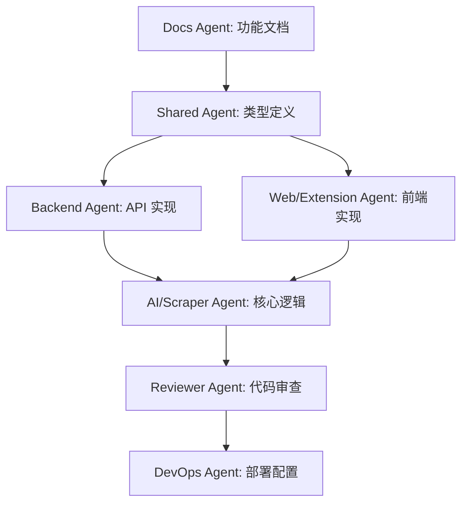
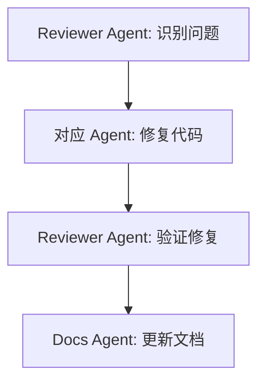
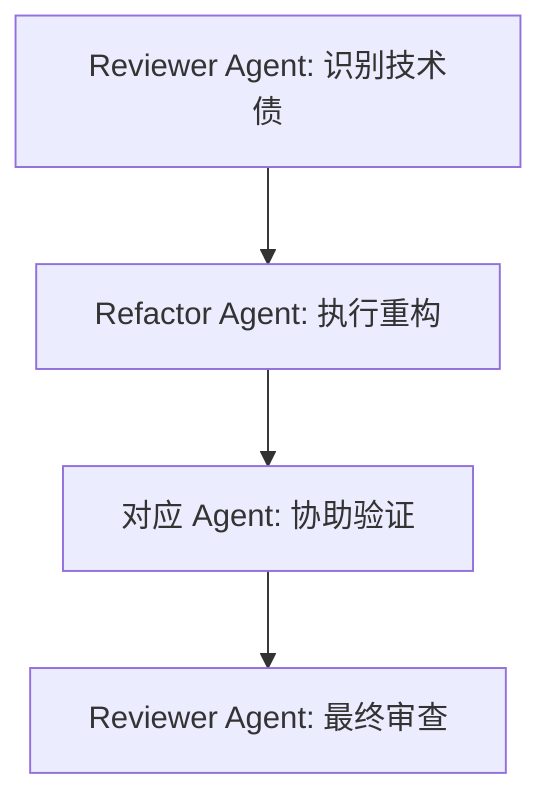

# Cursor Multi-Agent 使用指南

## 📋 概述

本项目使用 Cursor 的多 Agent 配置来实现清晰的职责分工和高效的团队协作。

**配置文件**: `.cursorrules`

---

## 🤖 Agent 列表

### 1. Web Agent
- **职责**: Next.js Web 应用开发
- **范围**: `apps/web/`
- **技术栈**: Next.js 14, TypeScript, Tailwind CSS, React Query

### 2. Backend Agent
- **职责**: FastAPI 后端服务开发
- **范围**: `apps/backend/`
- **技术栈**: FastAPI, Python 3.11+, Pydantic, SQLAlchemy

### 3. Extension Agent
- **职责**: Chrome 浏览器插件开发
- **范围**: `apps/extension/`
- **技术栈**: Manifest V3, JavaScript ES6+, Chrome APIs

### 4. AI Pipeline Agent
- **职责**: AI 处理流程开发
- **范围**: `packages/ai-pipeline/`
- **技术栈**: TypeScript/Python, 通义千问 API, Langchain

### 5. Scraper Agent
- **职责**: 多平台爬虫逻辑开发
- **范围**: `packages/scrapers/`
- **技术栈**: TypeScript, CSS Selectors, DOM Manipulation

### 6. Shared Agent
- **职责**: 跨应用共享代码开发
- **范围**: `packages/shared/`
- **技术栈**: TypeScript, Zod, date-fns, lodash

### 7. Docs Agent
- **职责**: 项目文档编写和维护
- **范围**: `docs/**/*`, `*.md`
- **技术栈**: Markdown, Mermaid, JSDoc/TSDoc

### 8. Reviewer Agent
- **职责**: 代码审查和质量保证
- **范围**: 只读所有代码
- **输出**: 代码审查报告

### 9. Refactor Agent
- **职责**: 代码重构和技术债务清理
- **范围**: 所有代码（重构）
- **原则**: 不改变外部行为

### 10. DevOps Agent
- **职责**: CI/CD、部署和基础设施
- **范围**: `.github/workflows/`, `scripts/`, `Dockerfile`
- **技术栈**: GitHub Actions, Docker, Shell Script

---

## 🔄 协作流程

### 新功能开发流程



### Bug 修复流程



### 重构流程



---

## 📝 使用方法

### 1. 指定 Agent

在 Cursor 中，使用 `@agent` 命令指定特定 Agent：

```
@WebAgent 帮我创建一个候选人列表组件

@BackendAgent 实现候选人处理 API

@ReviewerAgent 审查这段代码
```

### 2. Agent 自动识别

Cursor 会根据文件路径自动识别对应的 Agent：

- 编辑 `apps/web/src/` → 自动使用 Web Agent
- 编辑 `apps/backend/app/` → 自动使用 Backend Agent
- 编辑 `docs/` → 自动使用 Docs Agent

### 3. 跨 Agent 协作

当需要跨模块修改时，明确指定多个 Agents：

```
@SharedAgent 定义 CandidateInfo 类型
@BackendAgent 使用这个类型实现 API
@WebAgent 在前端使用这个类型
```

---

## ⚠️ 注意事项

### Agent 边界

- ✅ **每个 Agent 只能修改自己职责范围内的文件**
- ❌ **严禁跨界修改其他 Agent 的代码**
- ⚠️ **跨模块修改需要多个 Agents 协作**

### 示例：正确 vs 错误

#### ❌ 错误示例
```
# Web Agent 直接修改后端代码
@WebAgent 修改 apps/backend/app/main.py 的 API 逻辑
```

#### ✅ 正确示例
```
# 先让 Backend Agent 修改 API
@BackendAgent 修改 /api/candidates/process 接口

# 然后让 Web Agent 调用新 API
@WebAgent 更新前端调用新的 API 格式
```

---

## 🎯 最佳实践

### 1. 单一职责

每次只让一个 Agent 做一件事：

```
@BackendAgent 实现用户认证 API

@WebAgent 实现登录页面

@DocsAgent 编写认证 API 文档
```

### 2. 明确依赖

先定义接口，再实现功能：

```
@SharedAgent 定义 AuthRequest 和 AuthResponse 类型

@BackendAgent 基于这些类型实现认证 API

@WebAgent 基于这些类型实现登录表单
```

### 3. 代码审查

重要代码变更必须经过 Reviewer Agent：

```
@ReviewerAgent 审查 apps/backend/app/auth.py 的安全性
```

### 4. 文档同步

代码变更后立即更新文档：

```
@BackendAgent 实现新 API

@DocsAgent 更新 API 文档和示例
```

---

## 🔧 配置说明

### 编辑 `.cursorrules`

如需修改 Agent 配置，编辑根目录的 `.cursorrules` 文件。

### 添加新 Agent

1. 复制现有 Agent 模板
2. 定义职责范围
3. 指定允许/禁止的目录
4. 定义输出格式

### 示例：添加 Test Agent

```markdown
# ============================================================
# Agent 11: Test Agent
# ============================================================

## 职责范围
你是 **Test Agent**，负责测试代码的编写和维护。

## 核心职责
1. 单元测试编写
2. 集成测试编写
3. E2E 测试编写
4. 测试覆盖率提升

## 允许编辑的目录
- `apps/*/tests/**/*`
- `packages/*/tests/**/*`
- `**/*.test.ts`
- `**/*.test.py`

## 禁止编辑的目录
- `apps/*/src/**/*` (除了测试文件)
- `packages/*/src/**/*` (除了测试文件)
```

---

## 📚 相关文档

- [如何选择合适的Agent](./如何选择合适的Agent.md) - **新手必读**
- [Cursor 官方文档](https://cursor.sh/docs)
- [CURSOR-SUBAGENT-使用指南](./CURSOR-SUBAGENT-使用指南.md)

---

## 🤝 协作示例

### 示例 1: 实现候选人搜索功能

```bash
# Step 1: 定义类型
@SharedAgent 定义 SearchRequest 和 SearchResponse 类型

# Step 2: 实现后端
@BackendAgent 实现 /api/candidates/search 接口

# Step 3: 实现前端
@WebAgent 实现搜索组件和搜索页面

# Step 4: 编写文档
@DocsAgent 编写搜索功能使用文档

# Step 5: 代码审查
@ReviewerAgent 审查搜索功能的性能和安全性

# Step 6: 部署
@DevOpsAgent 配置搜索功能的监控和日志
```

### 示例 2: 修复性能问题

```bash
# Step 1: 识别问题
@ReviewerAgent 分析 /api/candidates/list 接口的性能瓶颈

# Step 2: 重构代码
@RefactorAgent 优化数据库查询，添加缓存

# Step 3: 验证修复
@BackendAgent 运行性能测试，确认改进

# Step 4: 更新文档
@DocsAgent 更新性能优化记录和最佳实践
```

---

## 🎓 学习资源

### Cursor Multi-Agent 最佳实践

1. **职责清晰**: 每个 Agent 专注自己的领域
2. **边界明确**: 不越界修改其他模块
3. **协作高效**: 通过接口和流程协作
4. **质量保证**: 所有代码经过审查
5. **文档同步**: 代码和文档一起更新

### 项目特定规则

- **Boss 直聘爬虫**: 必须遵守 ToS，有限流和备选方案
- **AI API 调用**: 优先通义千问，控制成本和 Token
- **数据隐私**: 简历数据加密存储，不泄露隐私
- **飞书集成**: API 调用有重试，批量操作有限流

---

## 💡 提示

### 如何选择正确的 Agent？

- 修改 Web 界面 → Web Agent
- 修改 API 逻辑 → Backend Agent
- 修改插件功能 → Extension Agent
- 修改 AI 逻辑 → AI Pipeline Agent
- 修改爬虫逻辑 → Scraper Agent
- 修改共享代码 → Shared Agent
- 修改文档 → Docs Agent
- 代码审查 → Reviewer Agent
- 代码重构 → Refactor Agent
- 修改部署 → DevOps Agent

### 常见问题

**Q: 如果需要跨多个模块修改怎么办？**
A: 分步骤，每个 Agent 处理自己的部分。先 Shared Agent 定义接口，再各自实现。

**Q: Agent 拒绝修改某个文件怎么办？**
A: 检查文件是否在 Agent 的职责范围内。如果不在，使用正确的 Agent。

**Q: 如何确保代码质量？**
A: 所有重要变更都经过 Reviewer Agent 审查，然后由 Refactor Agent 优化。

---

**祝开发顺利！** 🚀

