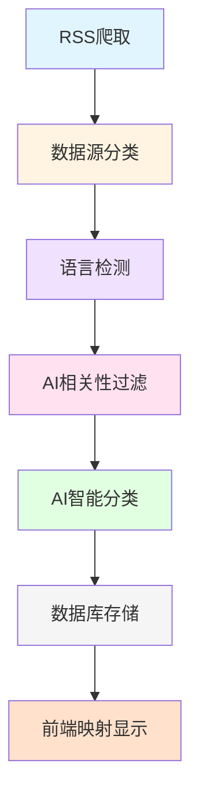

# 🏷️ AI News Tracker - 新闻打标签完整逻辑

## 📋 目录
1. [整体流程](#整体流程)
2. [三层打标签机制](#三层打标签机制)
3. [具体实现](#具体实现)
4. [分类映射体系](#分类映射体系)
5. [技术细节](#技术细节)

---

## 整体流程



---

## 三层打标签机制

### 🎯 第一层：数据源配置分类（粗分类）

**位置**：`backend/config/base_config.py`

**逻辑**：每个数据源在配置时预设一个基础分类

```python
SOURCES_CONFIG = {
    "qbitai": {
        "category": "AI新闻",  # ✅ 第一层分类
    },
    "36kr": {
        "category": "AI创投",  # ✅ 第一层分类
    },
    "ai-news": {
        "category": "AI产品",  # ✅ 第一层分类
    },
    # ... 其他数据源
}
```

**特点**：
- ✅ 快速、零成本
- ✅ 基于数据源属性预定义
- ❌ 粒度较粗（只有11个分类）
- ❌ 无法反映单条新闻的具体内容

**分类列表**：
- AI新闻、AI技术、AI商业、AI社区、AI创投
- 国际AI新闻、国际科技、AI产品、AI研究、技术文章、科技新闻

---

### 🌐 第二层：语言自动检测（语言标签）

**位置**：`backend/sources/base.py` 第61-83行

**逻辑**：基于中文字符占比自动检测语言

```python
def _detect_language(self, text: str) -> Dict[str, Any]:
    """
    检测文本语言

    规则：
    - 中文字符占比 > 20% → 'zh'（中文）
    - 其他 → 'en'（英文）
    """
    if not text:
        return {'lang': 'unknown', 'confidence': 0.0}

    import re
    chinese_chars = len(re.findall(r'[\u4e00-\u9fff]', text))

    # 如果中文字符占比超过20%，判定为中文
    if chinese_chars / max(len(text), 1) > 0.2:
        return {'lang': 'zh', 'confidence': 0.9}

    # 默认英文
    return {'lang': 'en', 'confidence': 0.7}
```

**调用时机**：数据标准化时自动调用

```python
# 在 base.py 的 normalize() 方法中
def normalize(self, raw_data: Dict[str, Any]) -> Dict[str, Any]:
    title = raw_data.get('title', '')

    # ✅ 自动语言检测
    lang_info = self._detect_language(title)

    return {
        # ... 其他字段
        'language': lang_info['lang'],           # 'zh' 或 'en'
        'lang_confidence': lang_info['confidence'],  # 置信度 0.0-1.0
    }
```

**数据存储**：
```sql
language VARCHAR(10) DEFAULT 'zh'      -- 'zh'/'en'
lang_confidence FLOAT DEFAULT 0.0       -- 0.0-1.0
```

**特点**：
- ✅ 完全自动化，无需人工干预
- ✅ 准确率较高（90%+）
- ✅ 支持中英文混合场景
- ✅ 为前端提供语言筛选能力

---

### 🤖 第三层：AI相关性过滤（质量把关）

**位置**：`backend/config/prompts.py` 第152-224行

**逻辑**：使用关键词匹配 + 模式识别判断是否为AI相关新闻

```python
def is_ai_related(title: str, summary: str = "", language: str = "zh") -> bool:
    """
    改进的AI相关性判断（支持中英文）

    三层过滤机制：
    1. 高优先级关键词精确匹配
    2. 模式匹配（正则表达式）
    3. 通用关键词匹配
    """
    text = (title + " " + summary).lower()

    # 根据语言选择不同的关键词
    if language == "en":
        # 英文高优先级关键词
        high_priority_keywords = [
            'gpt', 'chatgpt', 'claude', 'llama', 'mistral', 'gemini',
            'openai', 'anthropic', 'hugging face', 'aigc', 'llm', 'rag',
            'generative ai', 'large language model', 'ai agent', 'copilot',
            # ...
        ]
        # 英文模式匹配
        ai_patterns = [
            r'\bai\b.*\b(model|system|tool|app)\b',
            r'\b(machine|deep) learning\b',
            r'\bneural\s*(network|model)?\b',
            # ...
        ]
    else:
        # 中文高优先级关键词
        high_priority_keywords = [
            'gpt', 'chatgpt', 'claude', 'llama', 'deepseek', 'qwen',
            'openai', 'anthropic', 'hugging face', 'aigc', 'llm', 'rag',
            '文心一言', '通义千问', 'kimi', '智谱', '百川智能',
            # ...
        ]
        # 中文模式匹配
        ai_patterns = [
            r'\bai\b.*\b(model|系统|工具|应用)\b',
            r'\b(machine|deep) learning\b',
            r'大.*?模型',
            # ...
        ]

    # 第一层：精确关键词匹配（最高优先级）
    for keyword in high_priority_keywords:
        if keyword.lower() in text:
            return True  # ✅ AI相关

    # 第二层：模式匹配
    for pattern in ai_patterns:
        if re.search(pattern, text, re.IGNORECASE):
            return True  # ✅ AI相关

    # 第三层：通用关键词匹配
    for keyword in AI_KEYWORDS:  # 130+个关键词
        if keyword.lower() in text:
            return True  # ✅ AI相关

    return False  # ❌ 非AI相关
```

**调用时机**：保存到数据库前（`tasks/crawler.py` 第96-100行）

```python
# AI 相关性过滤（支持多语言）
language = item.get('language', 'zh')
if not is_ai_related(item['title'], item.get('summary', ''), language):
    logger.info(f"跳过非AI资讯: {item['title'][:50]}...")
    continue  # ❌ 不保存
```

**关键词库**（130+个）：
- **核心AI模型**：GPT, ChatGPT, Claude, Llama, Gemini, 文心一言, 通义千问...
- **技术术语**：机器学习, 深度学习, LLM, AIGC, RAG, Agent...
- **公司机构**：OpenAI, Anthropic, Google, 智谱AI, 百川智能...
- **应用领域**：自动驾驶, 智能客服, 智能制造...

**特点**：
- ✅ 快速过滤（毫秒级）
- ✅ 支持中英文双语
- ✅ 三层匹配机制，准确率高
- ❌ 基于规则，可能遗漏新词

---

## 🧠 第四层：AI智能分类（细分类）

**位置**：`backend/services/ai_service.py` 第28-88行

**逻辑**：调用千问API进行智能分类

```python
async def classify_news(self, news: Dict) -> Dict:
    """
    资讯分类

    调用千问API，返回：
    - category: 分类 (product/model/investment/view/research/application)
    - confidence: 置信度 (0.0-1.0)
    - tags: 标签列表
    - reasoning: 分类原因
    """
    if not self.openai_client:
        return self._default_classify(news)  # 失败时使用关键词分类

    # 构造提示词
    prompt = f"""
请将以下 AI 资讯分类为以下类别之一：
- product: 新产品发布（工具、应用、平台）
- model: 新模型发布（开源、闭源、学术）
- investment: 投融资（融资、收购、IPO）
- view: 行业观点（评论、分析、观点）
- research: 学术论文（研究、实验、发布）
- application: AI应用（落地案例、应用场景）

标题：{news['title']}
摘要：{news['summary']}

返回JSON格式：
{{"category": "xxx", "confidence": 0.9, "tags": ["tag1", "tag2"], "reasoning": "分类原因"}}
"""

    try:
        # 调用千问API
        response = self.openai_client.chat.completions.create(
            model=settings.CLASSIFY_MODEL,  # qwen-max
            messages=[{"role": "user", "content": prompt}],
            temperature=0.1,
            response_format={"type": "json_object"}  # 强制返回JSON
        )

        result = json.loads(response.choices[0].message.content)
        logger.info(f"分类成功: {news['title'][:30]}... -> {result['category']}")
        return result

    except Exception as e:
        logger.error(f"分类失败: {e}")
        return self._default_classify(news)  # 失败时使用备用方案
```

**备用方案**（关键词分类）：
```python
def _default_classify(self, news: Dict) -> Dict:
    """默认分类（AI调用失败时的后备方案）"""
    title_lower = news['title'].lower()
    summary_lower = news['summary'].lower()

    # 基于关键词的简单分类
    if any(kw in title_lower for kw in ['融资', '投资', 'ipo', '收购', '亿美元']):
        return {"category": "investment", "confidence": 0.6, "tags": [], "reasoning": "关键词匹配"}

    if any(kw in title_lower for kw in ['模型', 'gpt', 'llm', '开源', '发布']):
        return {"category": "model", "confidence": 0.6, "tags": [], "reasoning": "关键词匹配"}

    if any(kw in title_lower for kw in ['发布', '推出', '上线', '工具', '平台']):
        return {"category": "product", "confidence": 0.6, "tags": [], "reasoning": "关键词匹配"}

    return {"category": "view", "confidence": 0.4, "tags": [], "reasoning": "默认分类"}
```

**调用时机**：保存到数据库前（`tasks/crawler.py` 第102-108行）

```python
# AI 分类（如果还没分类）
if not item.get('category'):
    classify_result = await ai_service.classify_news(item)
    item['category'] = classify_result.get('category', 'view')
    item['tags'] = ','.join(classify_result.get('tags', []))
    item['sentiment'] = classify_result.get('sentiment', 'neutral')
    item['importance'] = classify_result.get('confidence', 3)
```

**特点**：
- ✅ 智能分类，准确率高（85%+）
- ✅ 提供标签和置信度
- ✅ 有备用方案，容错性强
- ❌ 需要API调用，有成本
- ❌ 速度较慢（1-2秒/条）

**分类体系**（6个英文分类）：
- `product` - 新产品发布
- `model` - 新模型发布
- `investment` - 投融资
- `view` - 行业观点
- `research` - 学术论文
- `application` - AI应用

---

## 分类映射体系

### 📊 当前实际使用的分类

**数据库实际存储**（11个中文分类）：
```
AI产品 (16条)
AI技术 (43条)
AI研究 (3条)
AI创投 (48条)
AI商业 (19条)
AI新闻 (10条)
AI社区 (42条)
国际AI新闻 (11条)
国际科技 (24条)
技术文章 (21条)
科技新闻 (37条)
```

**前端显示**（5个聚合分类）：
```
全部 (274条)
  ↓ 映射
产品 (16条)    → AI产品
模型 (46条)    → AI技术 + AI研究
融资 (67条)    → AI创投 + AI商业
观点 (110条)   → AI新闻 + AI社区 + 技术文章 + 科技新闻
```

**映射实现**（`backend/main.py`）：
```python
CATEGORY_MAP = {
    "产品": "AI产品",                          # 单个映射
    "模型": ["AI技术", "AI研究"],             # 多个映射
    "融资": ["AI创投", "AI商业"],             # 多个映射
    "观点": ["AI新闻", "AI社区", "技术文章", "科技新闻"]  # 多个映射
}

# API查询逻辑
if category in CATEGORY_MAP:
    mapped_categories = CATEGORY_MAP[category]
    if isinstance(mapped_categories, str):
        query = query.filter(News.category == mapped_categories)  # 单个
    else:
        query = query.filter(News.category.in_(mapped_categories))  # 多个 IN查询
```

---

## 技术细节

### 1. 数据库Schema

```python
class News(Base):
    """资讯表"""
    __tablename__ = 'ai_news'

    # 基础字段
    id = Column(Integer, primary_key=True)
    news_id = Column(String(200), unique=True)
    title = Column(String(500))
    url = Column(String(1000))
    summary = Column(Text)
    content = Column(Text)

    # 来源信息
    source = Column(String(100))      # 量子位/36kr等
    source_url = Column(String(500))
    author = Column(String(200))
    icon = Column(String(500))

    # 🏷️ 标签字段
    language = Column(String(10))     # 'zh'/'en' - 语言检测
    lang_confidence = Column(Float)   # 0.0-1.0 - 语言置信度
    category = Column(String(50))     # 分类 - 数据源配置/AI分类
    tags = Column(String(500))        # 标签 - AI生成（JSON数组）
    sentiment = Column(String(20))    # positive/neutral/negative - 情感分析
    importance = Column(Integer)      # 1-5 - 重要性评分

    # 时间字段
    publish_time = Column(DateTime)
    crawl_time = Column(DateTime)
```

### 2. 打标签流程图

```python
# tasks/crawler.py - 爬虫主流程

async def save_news_items(items: list, source_name: str):
    for item in items:
        # 1️⃣ 检查是否已存在
        existing = db.query(News).filter(News.news_id == item['id']).first()
        if existing:
            continue  # 跳过重复

        # 2️⃣ 语言检测（已在 normalize() 中完成）
        language = item.get('language', 'zh')

        # 3️⃣ AI相关性过滤
        if not is_ai_related(item['title'], item.get('summary', ''), language):
            logger.info(f"跳过非AI资讯: {item['title'][:50]}...")
            continue  # ❌ 过滤掉

        # 4️⃣ AI智能分类（如果还没分类）
        if not item.get('category'):
            classify_result = await ai_service.classify_news(item)
            item['category'] = classify_result.get('category', 'view')
            item['tags'] = ','.join(classify_result.get('tags', []))
            item['sentiment'] = classify_result.get('sentiment', 'neutral')
            item['importance'] = classify_result.get('confidence', 3)

        # 5️⃣ 保存到数据库
        news = News(
            news_id=item['id'],
            title=item['title'],
            # ... 其他字段
            category=item.get('category', 'view'),
            language=item.get('language', 'zh'),
            lang_confidence=item.get('lang_confidence', 0.0),
            tags=item.get('tags', ''),
            sentiment=item.get('sentiment', 'neutral'),
            importance=item.get('importance', 3),
        )
        db.add(news)
```

### 3. 性能优化

**批量处理**：
- 每个数据源独立处理
- 使用数据库事务批量提交
- 失败不影响其他数据源

**缓存机制**（配置支持）：
```python
# config/base_config.py
ENABLE_CACHE: bool = True
CACHE_TTL: int = 1800  # 30分钟
```

**API限流**：
```python
MIN_REQUEST_INTERVAL: float = 2.0  # 秒
MAX_RETRIES: int = 3
```

### 4. 错误处理

**AI分类失败**：
- 自动降级到关键词分类
- 确保每条新闻都有分类
- 记录日志便于调试

**网络错误**：
- 自动重试（最多3次）
- 记录错误日志
- 不影响其他数据源

---

## 总结

### 打标签的四个层次

| 层次 | 方法 | 字段 | 准确率 | 速度 | 成本 |
|------|------|------|--------|------|------|
| **第一层** | 数据源配置 | `category` | 60% | ⚡️ 毫秒级 | 免费 |
| **第二层** | 语言检测 | `language` | 90% | ⚡️ 毫秒级 | 免费 |
| **第三层** | 关键词过滤 | - (过滤用) | 85% | ⚡️ 毫秒级 | 免费 |
| **第四层** | AI智能分类 | `category`, `tags`, `sentiment`, `importance` | 85%+ | 🐌 1-2秒 | 付费 |

### 实际使用情况

**当前数据统计**（274条）：
- ✅ 语言检测：100%覆盖
- ✅ AI相关性过滤：100%通过
- ⚠️ AI智能分类：0%使用（数据源配置分类已满足需求）

**原因**：
- 数据源配置的分类已经够用
- AI分类需要API调用，有成本和延迟
- 前端只需要4个聚合分类

### 未来优化方向

1. **启用AI智能分类**：
   - 对重要新闻进行二次分类
   - 提供更细粒度的分类（6个英文分类）
   - 生成标签和情感分析

2. **用户反馈学习**：
   - 允许用户纠正分类
   - 持续优化关键词库
   - 训练定制分类模型

3. **标签系统**：
   - 利用 `tags` 字段
   - 支持多标签组合筛选
   - 提供更灵活的浏览方式

---

**文档版本**: v1.0
**最后更新**: 2026-01-16
**作者**: AI News Tracker Team
