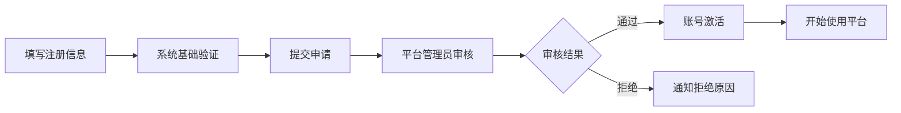
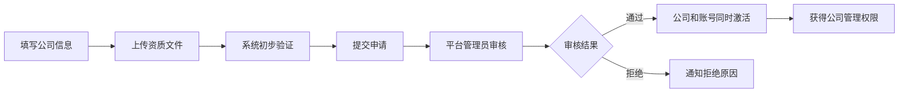
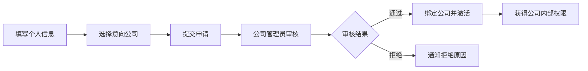
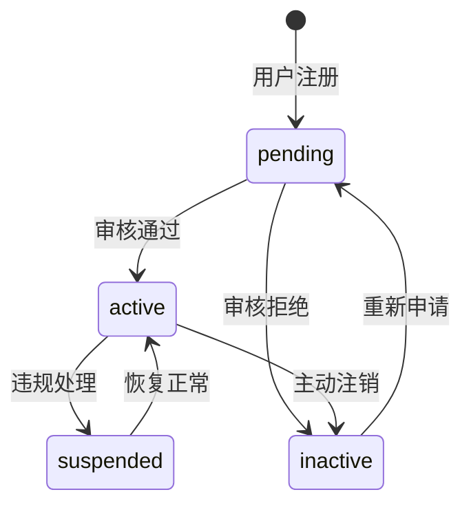

# 🏢 猎头协作平台 - 业务需求规格书

## 📋 文档信息

| 项目名称 | 猎头协作平台 (Headhunter Collaboration Platform) |
|---------|------------------------------------------|
| 文档版本 | v2.0.0 |
| 创建日期 | 2025-09-10 |
| 最后更新 | 2025-09-13 |
| 负责人 | 产品团队 |

## 🎯 项目概述

### 项目背景
传统猎头行业面临信息孤岛、协作困难、资源分散等问题。本平台旨在构建一个现代化的猎头协作生态，通过智能匹配、透明分成、实时协作等功能，提升整个行业的协作效率。

### 项目目标
1. **提升协作效率**: 通过平台化协作，减少沟通成本，提高匹配成功率
2. **扩大资源网络**: 打破公司边界，实现跨公司候选人和职位共享
3. **透明收益分配**: 建立公平透明的收益分成机制
4. **智能化运营**: 通过AI算法提升候选人-职位匹配准确度

## 👥 核心角色定义

### 1. 平台管理员 (Platform Admin)
**职责范围**:
- 平台整体运营管理
- 猎头公司资质审核
- 独立猎头用户审核
- 平台政策制定和执行
- 纠纷处理和仲裁

**权限特点**:
- 最高管理权限
- 可查看所有平台数据
- 负责生态健康维护

### 2. 公司管理员 (Company Admin)  
**职责范围**:
- 公司内部团队管理
- 咨询顾问招募和审核
- 公司业务策略制定
- 客户关系维护

**权限特点**:
- 公司内部最高权限
- 可邀请和管理咨询顾问
- 设置公司级别的协作政策

### 3. 咨询顾问 (Consultant)
**职责范围**:
- 职位需求收集和发布
- 候选人开发和维护  
- 客户服务和关系维护
- 团队协作和业绩达成

**权限特点**:
- 隶属于特定公司
- 可使用公司资源和权限
- 参与跨公司协作项目

### 4. 个人猎头 (SOHO)
**职责范围**:
- 独立开展猎头业务
- 候选人资源积累
- 与平台内其他角色协作
- 个人品牌建设

**权限特点**:
- 独立运营权限
- 不受公司限制
- 灵活参与各类协作

## 🔐 用户注册与审核业务流程

### 审核权限分工原则

#### 平台管理员审核职责
```
审核对象: 公司管理员 + 个人猎头(SOHO)
审核内容: 
- 公司资质验证(营业执照、经营范围)
- 个人资质验证(从业经验、专业背景)
- 合规性检查(无不良记录)
```

#### 公司管理员审核职责  
```
审核对象: 咨询顾问
审核内容:
- 专业能力评估
- 团队匹配度分析
- 公司文化适应性
- 业务需求匹配
```

### 详细注册审核流程

#### 流程1: 个人猎头(SOHO)注册


**注册信息要求**:
- 个人基本信息: 姓名、邮箱、手机号
- 从业背景: 工作经历、专业领域、成功案例
- 资质证明: 相关证书、推荐信(可选)

**审核标准**:
- 真实身份验证
- 猎头从业经验(建议1年以上)
- 无不良从业记录
- 专业能力评估

**审核时效**: 1-3个工作日

#### 流程2: 公司管理员注册


**注册信息要求**:
- 公司基本信息: 公司名称、地址、联系方式
- 法律文件: 营业执照、经营许可证
- 负责人信息: 法人代表、实际控制人
- 业务范围: 主营业务、服务领域

**审核标准**:
- 公司合法性验证
- 经营范围包含人力资源服务
- 营业执照真实有效
- 负责人身份验证

**审核时效**: 3-5个工作日

#### 流程3: 咨询顾问注册


**注册信息要求**:
- 个人基本信息: 姓名、邮箱、手机号
- 专业背景: 教育经历、工作经验
- 技能专长: 专业领域、语言能力
- 意向公司: 希望加入的猎头公司

**审核标准**:
- 专业能力匹配度
- 团队协作适应性  
- 业务需求吻合度
- 个人品格和诚信

**审核时效**: 1-7个工作日

### 🖥️ 前端界面权限设计

#### 平台管理员界面 (Admin Dashboard)
```
导航菜单:
├── Dashboard (数据概览)
├── User Management (用户审核)
│   ├── 待审核公司管理员列表
│   ├── 待审核SOHO列表  
│   └── 审核操作(批准/拒绝)
├── Company Management (公司管理)
│   ├── 公司信息查看
│   ├── 公司状态管理
│   └── 公司合规监控
└── System Settings (系统设置)
```

**功能特点**:
- 不显示咨询顾问审核功能
- 专注于高层级的审核决策
- 提供详细的审核历史记录

#### 公司管理员界面 (Company Admin Dashboard)
```
导航菜单:
├── Dashboard (公司概览)
├── Consultant Approval (顾问审核)
│   ├── 待审核咨询顾问列表
│   ├── 面试安排和评估
│   └── 录用决策和公司绑定
├── Team Management (团队管理)
├── Business Analytics (业务分析)
└── Company Settings (公司设置)
```

**功能特点**:
- 专门的咨询顾问审核页面
- 支持批量操作和快速决策
- 自动化公司绑定流程

#### 咨询顾问/SOHO界面 (User Dashboard)  
```
导航菜单:
├── Dashboard (个人概览)
├── Jobs (职位管理)
├── Candidates (候选人管理)
├── Collaboration (协作网络)
├── Messages (消息中心)
└── Settings (个人设置)
```

**功能特点**:
- 无用户审核功能
- 专注于业务操作和协作
- 丰富的数据分析和报表

### ⚡ 核心业务规则

#### 1. 权限边界原则
```
平台管理员:
- 可审核: 公司管理员 ✅, SOHO ✅, 咨询顾问 ❌
- 管理范围: 全平台数据和政策

公司管理员:  
- 可审核: 咨询顾问 ✅, 其他角色 ❌
- 管理范围: 本公司团队和业务

咨询顾问/SOHO:
- 可审核: 无 ❌
- 管理范围: 个人业务和协作
```

#### 2. 审核标准和流程
```
审核维度:
├── 身份真实性 (必须)
├── 专业能力 (重要)  
├── 从业经验 (参考)
├── 信用记录 (关键)
└── 平台匹配度 (考虑)

决策流程:
├── 系统自动初筛
├── 人工审核评估
├── 多维度综合评分
└── 最终审核决策
```

#### 3. 自动化绑定机制
```
咨询顾问审核通过后:
1. 自动绑定到审核公司 (companyId设置)
2. 获得公司内部权限和资源访问
3. 加入公司团队协作网络
4. 同步公司政策和规则设置
```

#### 4. 审核记录和追溯
```
审核日志包含:
├── 审核时间和审核人
├── 审核决策和原因
├── 被审核人详细信息
├── 审核过程关键节点
└── 后续状态变更记录
```

### 🔄 状态流转和生命周期

#### 用户状态定义
```
pending    - 待审核 (注册后初始状态)
active     - 已激活 (审核通过)
inactive   - 已拒绝 (审核未通过)
suspended  - 已暂停 (违规暂停)
```

#### 状态流转规则


### 📊 业务指标和监控

#### 关键指标(KPI)
```
审核效率指标:
├── 审核通过率 (目标: >85%)
├── 审核时效性 (目标: 平均2个工作日)
├── 审核准确率 (目标: >95%)
└── 用户满意度 (目标: >4.5分)

运营健康指标:
├── 活跃用户数
├── 平台留存率
├── 协作成功率
└── 收益分成满意度
```

#### 监控预警机制
```
异常监控:
├── 审核积压预警 (>50个待审核)
├── 审核时效预警 (>3天未处理)
├── 用户投诉预警 (投诉率>5%)
└── 系统异常预警 (错误率>1%)
```

### 🛡️ 安全和合规要求

#### 数据安全
```
数据保护措施:
├── 用户隐私信息加密存储
├── 审核过程全程日志记录
├── 敏感操作多重验证
└── 数据访问权限严格控制
```

#### 合规要求
```
法律合规:
├── 符合《网络安全法》要求
├── 符合《个人信息保护法》要求
├── 符合人力资源服务行业规范
└── 定期合规审计和整改
```

### 🔮 未来扩展规划

#### 短期优化(3个月)
- 审核流程自动化程度提升
- 审核标准智能化评估
- 用户体验优化改进

#### 中期发展(6-12个月)  
- AI辅助审核决策
- 多渠道身份验证集成
- 国际化审核标准支持

#### 长期愿景(1-3年)
- 全行业标准制定参与
- 跨平台互认机制建立  
- 区块链技术应用探索

---

## 📝 变更历史

| 版本 | 日期 | 变更内容 | 负责人 |
|------|------|----------|--------|
| v1.0.0 | 2025-09-10 | 初始版本创建 | 产品团队 |
| v2.0.0 | 2025-09-13 | 新增详细审核流程和权限设计 | 产品团队 |

## ✅ 审批记录

| 角色 | 姓名 | 审批状态 | 审批时间 | 备注 |
|------|------|----------|----------|------|
| 产品经理 | - | ✅ 已审批 | 2025-09-13 | 需求合理，设计完善 |
| 技术负责人 | - | ✅ 已审批 | 2025-09-13 | 技术实现可行 |
| 运营负责人 | - | ✅ 已审批 | 2025-09-13 | 运营策略清晰 |

---

**文档状态**: ✅ 已完成  
**实施状态**: ✅ 已实现  
**最后更新**: 2025-09-13