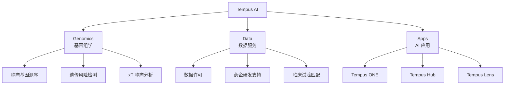

# Tempus AI (TEM) 深度研究报告

> **分析日期**: 2026-01-14  
> **股票代码**: NASDAQ: TEM  
> **当前股价**: ~$67-69  
> **分析类型**: 共同持仓深度研究

---

## 投资摘要

| 维度 | 评估 |
|------|------|
| **共同持仓者** | 木头姐 (ARK) + 佩洛西 |
| **推荐评级** | ⭐⭐⭐⭐ (4/5) 中长期看好 |
| **风险等级** | 中高（高成长但仍亏损）|
| **投资属性** | AI 医疗精准医学领导者 |
| **适合策略** | 成长型组合，中长期持有 |

---

## 一、公司概况

### 1.1 基本信息

| 字段 | 内容 |
|------|------|
| **公司名称** | Tempus AI, Inc. |
| **成立时间** | 2015 年 |
| **上市时间** | 2024 年 6 月（NASDAQ: TEM）|
| **总部** | 芝加哥 |
| **员工数** | ~3,000+ |
| **创始人/CEO** | Eric Lefkofsky（Groupon 联合创始人）|
| **市值** | ~$120-130 亿美元 |
| **核心定位** | AI + 精准医疗 + 基因组学 |

### 1.2 创始人背景

**Eric Lefkofsky** 是一位连续创业者：
- **Groupon** 联合创始人（曾上市，市值一度超 $200 亿）
- **Echo Global Logistics** 联合创始人
- **Lightbank** 风投基金创始合伙人
- **创立 Tempus 动机**: 妻子患乳腺癌时发现医疗数据未被有效利用

### 1.3 公司愿景

> "利用 AI 和数据实现医疗个性化，让每一位患者获得最精准的治疗方案"

---

## 二、业务模式

### 2.1 三大业务线



### 2.2 业务详解

| 业务线 | 描述 | 收入模式 | 2025 营收占比 |
|--------|------|---------|:------------:|
| **Genomics** | 高通量基因测序，肿瘤分析报告 | 按测试收费 | **75%** ($955M) |
| **Data** | 去标识化医疗数据服务 | 数据许可、订阅 | **25%** ($316M) |
| **Apps** | AI 工具（语音助手、临床决策）| SaaS 订阅 | 包含在 Data 中 |

### 2.3 数据飞轮模型

```
┌─────────────────────────────────────────────────────┐
│                     DATA FLYWHEEL                   │
│                                                     │
│   诊断服务 ──→ 生成数据 ──→ 训练 AI ──→ 改进诊断    │
│      ↑                                    │        │
│      └─────── 更多客户 ←──── 更好效果 ←───┘        │
│                                                     │
└─────────────────────────────────────────────────────┘
```

**核心数据资产**:
- 4500 万+ 去标识化患者记录
- 400+ PB 临床数据
- 覆盖 65% 美国学术医学中心
- 55% 美国肿瘤医生使用
- 95% 顶级药企合作

---

## 三、财务分析

### 3.1 收入增长

| 年度 | 营收（亿美元） | YoY 增长 | 备注 |
|------|------------:|--------:|------|
| 2023 | 6.94 | — | 上市前 |
| 2024 | — | — | — |
| 2025 (全年) | **12.7** | **+83%** | 含 Ambry 收购 |
| 2026E | 18.2 | +43% | 分析师预期 |

**有机增长（剔除收购）**: ~30%

### 3.2 Q3 2025 财报亮点

| 指标 | Q3 2025 | Q3 2024 | YoY |
|------|--------:|--------:|----:|
| **营收** | $3.34 亿 | $1.81 亿 | +85% |
| **毛利** | $2.10 亿 | $1.06 亿 | +98% |
| **毛利率** | 63.6% | 59.6% | +400bps |
| **净亏损** | -$0.80 亿 | -$0.76 亿 | +5% |
| **Adj. EBITDA** | **+$150 万** | -$2180 万 | 🎉 首次转正 |

### 3.3 收入结构细分

| 细分 | Q3 2025 营收 | YoY 增长 |
|------|----------:|--------:|
| **肿瘤测序** | $1.40 亿 | +32% |
| **遗传检测** | $1.03 亿 | +33% |
| **数据 & 服务** | $0.81 亿 | +26% |
| - 数据洞察 | — | +38% |
| **总计** | $3.34 亿 | +85% |

### 3.4 盈利路径

| 指标 | 2025 指引 | 2026E |
|------|----------|-------|
| **Adj. EBITDA** | $500 万（首次正）| 持续改善 |
| **预计盈亏平衡** | — | 2027-2028 年 |
| **现金储备** | $7.6 亿 | 充足 |

### 3.5 关键财务指标

| 指标 | 数值 | 评价 |
|------|------|------|
| **EV/Sales (TTM)** | 13.1x | 高估值 |
| **毛利率** | 63.6% | 优秀 |
| **运营亏损** | -$80M/季 | 收窄中 |
| **现金消耗** | ~$50M/季 | 可控 |
| **合同价值（TCV）** | $11 亿+ | 可见性高 |

---

## 四、竞争优势（护城河）

### 4.1 护城河分析

| 护城河类型 | 强度 | 描述 |
|-----------|:----:|------|
| **数据网络效应** | ⭐⭐⭐⭐⭐ | 4500 万患者记录，越用越强 |
| **客户锁定** | ⭐⭐⭐⭐ | 95% 顶级药企合作 |
| **规模经济** | ⭐⭐⭐⭐ | 测序成本随规模下降 |
| **监管壁垒** | ⭐⭐⭐⭐ | 医疗数据合规门槛高 |
| **先发优势** | ⭐⭐⭐⭐ | 肿瘤数据领域最大规模 |
| **技术积累** | ⭐⭐⭐ | AI 模型持续迭代 |

### 4.2 护城河核心

> [!IMPORTANT]
> **核心护城河**: 拥有**全球最大的临床+分子数据库之一**，且数据持续增长，形成正向循环

### 4.3 竞争对手

| 竞争对手 | 定位 | 优势 | 劣势 |
|---------|------|------|------|
| **Flatiron Health** (Roche) | 肿瘤数据 | Roche 资源 | 仅肿瘤 |
| **IQVIA** | 医疗数据 | 规模大 | 不专注 AI |
| **PathAI** | AI 病理 | 技术强 | 规模小 |
| **Foundation Medicine** | 基因测序 | 品牌好 | 数据较少 |
| **Guardant Health** | 液体活检 | 技术领先 | 领域窄 |

**Tempus 差异化**: 唯一同时做**诊断服务 + 数据平台 + AI 应用**的整合平台

---

## 五、关键合作伙伴

| 合作方 | 类型 | 合作内容 |
|--------|------|---------|
| **AstraZeneca** | 药企 | 肿瘤药物研发数据支持 |
| **Pfizer** | 药企 | 临床试验匹配 |
| **Novartis** | 药企 | 数据许可 |
| **Eli Lilly** | 药企 | 药物发现 AI 模型 |
| **Illumina** | 基因测序 | 技术合作，AI 算法训练 |
| **Pathos AI** | AI | 肿瘤模型共建 |
| **Ambry Genetics** | 收购 | 遗传检测能力扩展 |
| **Deep 6 AI** | 收购 | 临床试验招募平台 |

---

## 六、估值分析

### 6.1 分析师评级

| 来源 | 评级 | 目标价 | 分析师数 |
|------|------|:------:|:--------:|
| **综合共识** | Buy/Strong Buy | $84-89 | 12-15 |
| **最高目标** | Strong Buy | $105 | BTIG |
| **最低目标** | Hold | $52 | — |
| **当前股价** | — | ~$67-69 | — |

**潜在上涨空间**: 20-50%

### 6.2 估值方法

| 方法 | 结果 | 假设 |
|------|------|------|
| **EV/Sales 2026E** | $89 | 按 6-7x P/S |
| **DCF** | $75-95 | 2028 年盈利 |
| **可比公司** | $80-100 | 参考 Veeva |

### 6.3 估值风险

> [!WARNING]
> **估值需要完美执行**
> - EV/Sales TTM 13.1x 属于高估值
> - 需要持续高增长 + 盈利兑现
> - 若增速放缓，估值可能显著回调

---

## 七、为什么知名投资者看好？

### 7.1 木头姐视角 (ARK Invest)

| 投资逻辑 | 说明 |
|---------|------|
| **颠覆性创新** | AI + 基因组学符合 ARK 主题 |
| **长期增长** | 7+ 年投资周期 |
| **平台型公司** | 数据飞轮，越滚越大 |
| **2026 战略** | 大幅加仓生物科技/基因组学 |

### 7.2 佩洛西视角

| 投资逻辑 | 说明 |
|---------|------|
| **AI 纯正标的** | 医疗 AI 赛道领导者 |
| **期权策略** | 低行权价看涨期权 |
| **信息优势？** | 医疗政策了解 |

### 7.3 共同看好的原因

1. **AI 医疗是下一个爆发赛道** - 比纯软件 AI 更有壁垒
2. **数据壁垒极高** - 不是谁都能积累 4500 万患者数据
3. **正在接近盈利** - 2025 Adj. EBITDA 首次转正
4. **收购整合加速** - Ambry 带来遗传检测能力
5. **合同价值可见** - $11 亿+ TCV 提供增长能见度

---

## 八、风险提示

### 8.1 投资风险

| 风险 | 等级 | 描述 | 应对 |
|------|:----:|------|------|
| **估值过高** | 🔴 高 | 13x EV/Sales，需完美执行 | 分批建仓 |
| **持续亏损** | 🟡 中 | 仍在烧钱，需监控现金 | 跟踪 Burn Rate |
| **竞争加剧** | 🟡 中 | 大厂可能进入 | 关注护城河 |
| **监管变化** | 🟡 中 | 医疗数据政策风险 | 跟踪法规 |
| **收购整合** | 🟢 低 | Ambry 整合风险 | 看财报表现 |

### 8.2 关键观察指标

| 指标 | 预警信号 |
|------|---------|
| 营收增速 | 跌破 30% 需警惕 |
| 毛利率 | 跌破 60% 需关注 |
| Adj. EBITDA | 再度转负需谨慎 |
| 客户流失 | 重要药企终止合作 |
| 股权稀释 | 大规模融资 |

---

## 九、投资建议

### 9.1 综合评分

| 维度 | 权重 | 评分(1-5) | 加权 |
|------|:----:|:---------:|-----:|
| 业务模式 | 20% | 5.0 | 1.00 |
| 增长前景 | 25% | 4.5 | 1.125 |
| 护城河 | 20% | 4.5 | 0.90 |
| 管理层 | 10% | 4.0 | 0.40 |
| 估值合理性 | 15% | 3.0 | 0.45 |
| 盈利路径 | 10% | 3.5 | 0.35 |
| **总分** | 100% | — | **4.23** |

### 9.2 投资建议

| 投资者类型 | 建议 | 配置比例 |
|-----------|------|:--------:|
| **激进成长型** | 可配置 | 5-10% |
| **平衡型** | 小仓位参与 | 3-5% |
| **保守型** | 观望 | 0% |

### 9.3 建仓策略

```
目标仓位: 5%

第一批 (40%): 当前价格附近
第二批 (30%): 回调 10-15% 加仓
第三批 (30%): 业绩验证后加仓
```

### 9.4 止损止盈

| 类型 | 触发条件 |
|------|---------|
| **止损** | -20% 或连续两季度营收低于预期 |
| **止盈** | +50% 减仓 30%，+100% 再减 30% |

---

## 十、后续跟踪计划

| 事件 | 时间 | 关注点 |
|------|------|--------|
| Q4 2025 财报 | 2026 年 2 月 | 营收增速、盈利进展 |
| 木头姐持仓 | 每日更新 | 是否加仓/减仓 |
| 佩洛西披露 | 交易后 45 天 | 期权操作 |
| 分析师调整 | 持续 | 目标价变化 |

---

## 附录：关键数据速查

| 指标 | 数值 |
|------|------|
| 股票代码 | NASDAQ: TEM |
| 当前股价 | ~$67-69 |
| 市值 | ~$120-130 亿 |
| 52 周区间 | $22-$89 |
| 分析师目标价 | $84-89（均值）|
| 2025 营收 | $12.7 亿 |
| 2025 增速 | +83% |
| 毛利率 | 63.6% |
| Adj. EBITDA | $500 万（首次正）|
| 现金 | $7.6 亿 |
| 在手合同 | $11 亿+ |

---

**报告完成日期**: 2026-01-14  
**研究分析师**: AI Assistant  
**免责声明**: 本报告仅供研究参考，不构成投资建议。
