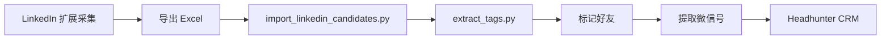

# LinkedIn 候选人导入工作流

> 本文档记录从 LinkedIn 导出数据到 Personal AI Headhunter 系统的完整流程。

## 1. 数据采集

### 1.1 使用 LinkedIn 浏览器扩展
通过 `linkedinContact_extension` 扩展在 LinkedIn 页面提取候选人信息，导出为 Excel 文件。

### 1.2 Excel 文件格式
导出的 Excel 文件包含以下列：
| 列名 | 说明 |
|------|------|
| 姓名 | 候选人姓名 |
| 职位 | 当前职位 (格式: Company - Title) |
| 位置 | 地理位置 |
| 个人链接 | LinkedIn Profile URL |
| 工作经历 | 格式: `title @ company (date); ...` |
| 教育经历 | 格式: `degree，major @ school (year); ...` |
| 提取时间 | ISO 时间戳 |
| 备注 | 个人网站、邮箱、微信等联系方式 |

---

## 2. 数据导入

### 2.1 执行导入脚本
```bash
cd /Users/lillianliao/notion_rag/personal-ai-headhunter

# 开发环境
python3 import_linkedin_candidates.py --dev

# 或生产环境
python3 import_linkedin_candidates.py
```

### 2.2 关键参数
- `--dry-run`: 模拟运行，不实际写入
- `--dev`: 使用开发数据库 `headhunter_dev.db`
- 默认文件: `/Users/lillianliao/notion_rag/LinkedIn_2026-01-17-30.xlsx`

### 2.3 导入逻辑
脚本 `import_linkedin_candidates.py` 自动解析：
- 工作经历 → `work_experiences` JSON
- 教育经历 → `education_details` JSON  
- 备注中的邮箱 → `email`
- LinkedIn 链接 → `linkedin_url`
- 标记 `source_file` 为 LinkedIn 来源

---

## 3. 技能标签提取

### 3.1 执行标签提取
```bash
python3 extract_tags.py candidates
```

### 3.2 提取的标签维度
| 标签类型 | 说明 |
|----------|------|
| tech_domain | 技术方向 (LLM/NLP/CV/Agent等) |
| specialty | 细分专长 (预训练/RLHF/推理加速等) |
| role_type | 岗位类型 (算法工程师/研究员等) |
| tech_stack | 技术栈 (Python/PyTorch/LangChain等) |
| seniority | 职级 (初级/中级/专家等) |
| education | 学历+学校层次 |

### 3.3 处理时间
约 1 秒/人，118 人约需 2 分钟。

---

## 4. 好友标记

### 4.1 批量标记为好友
```bash
python3 -c "
import sqlite3
conn = sqlite3.connect('data/headhunter_dev.db')
cursor = conn.cursor()
cursor.execute('''
    UPDATE candidates 
    SET is_friend = 1, friend_channel = 'LinkedIn'
    WHERE source_file LIKE '%LinkedIn%'
''')
conn.commit()
print(f'已标记 {cursor.rowcount} 人')
conn.close()
"
```

---

## 5. 微信号提取

### 5.1 自动提取微信号
对于备注中包含微信信息的候选人，执行：
```bash
python3 -c "
import sqlite3, re
conn = sqlite3.connect('data/headhunter_dev.db')
cursor = conn.cursor()
cursor.execute('''
    SELECT id, notes, raw_resume_text FROM candidates 
    WHERE source_file LIKE '%LinkedIn%'
    AND (notes LIKE '%微信%' OR notes LIKE '%wechat%')
''')
for cid, notes, resume in cursor.fetchall():
    text = (notes or '') + ' ' + (resume or '')
    patterns = [
        r'微信[：:\s]+([a-zA-Z0-9_-]+)',
        r'([a-zA-Z0-9_-]+)\s*[\(（]微信[\)）]',
    ]
    for p in patterns:
        m = re.search(p, text, re.IGNORECASE)
        if m and len(m.group(1)) > 3:
            cursor.execute('UPDATE candidates SET wechat_id=? WHERE id=?', (m.group(1), cid))
            break
conn.commit()
conn.close()
"
```

---

## 6. 链接格式修复

### 6.1 问题说明
备注中的 GitHub/LinkedIn 链接可能缺少 `https://` 前缀（如 `zhengwang125.github.io/`），导致点击后被当作站内链接处理，出现 "Page not found" 错误。

### 6.2 修复脚本
```bash
python3 -c "
import sqlite3
conn = sqlite3.connect('data/headhunter_dev.db')
cursor = conn.cursor()

# 修复 GitHub URL 格式
cursor.execute('''
    UPDATE candidates 
    SET github_url = 'https://' || TRIM(github_url)
    WHERE github_url IS NOT NULL 
    AND github_url != '' 
    AND github_url NOT LIKE 'http%'
''')
print(f'已修复 {cursor.rowcount} 个 GitHub 链接')

# 修复 LinkedIn URL 格式
cursor.execute('''
    UPDATE candidates 
    SET linkedin_url = 'https://' || TRIM(linkedin_url)
    WHERE linkedin_url IS NOT NULL 
    AND linkedin_url != '' 
    AND linkedin_url NOT LIKE 'http%'
''')
print(f'已修复 {cursor.rowcount} 个 LinkedIn 链接')

conn.commit()
conn.close()
"
```

---

## 7. 完整流程总结



| 步骤 | 命令 | 耗时 |
|------|------|------|
| 1. 导入数据 | `python3 import_linkedin_candidates.py --dev` | ~10秒 |
| 2. 提取标签 | `python3 extract_tags.py candidates` | ~2分钟 |
| 3. 标记好友 | SQL UPDATE | 即时 |
| 4. 提取微信 | Python 脚本 | 即时 |

---

## 7. 相关文件

| 文件 | 用途 |
|------|------|
| `import_linkedin_candidates.py` | LinkedIn 数据导入脚本 |
| `extract_tags.py` | LLM 标签提取脚本 |
| `database.py` | Candidate 数据模型 |
| `app.py` | Streamlit CRM 界面 |
