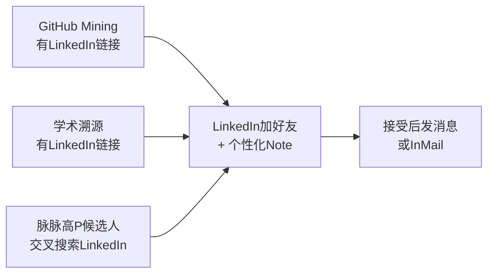
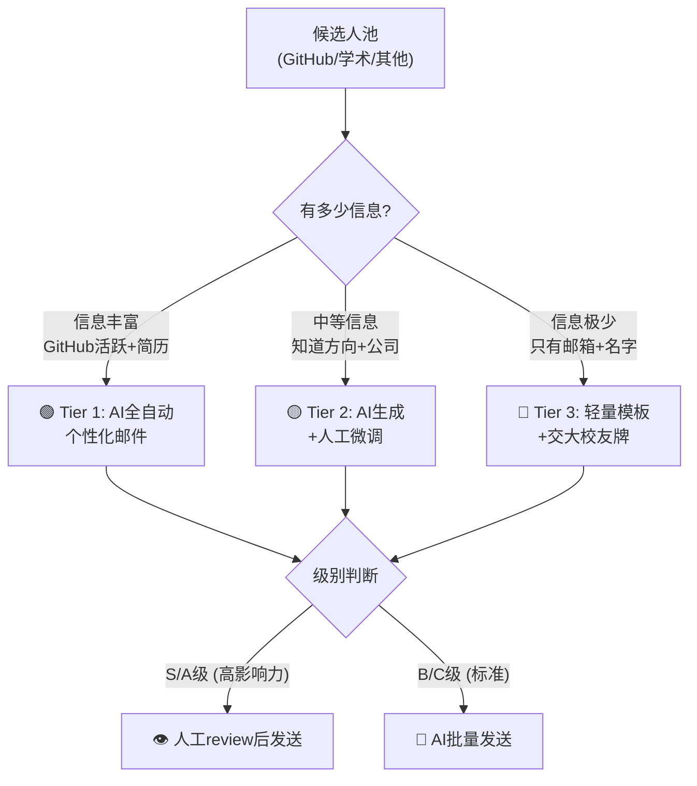

# 🎯 多渠道人才Sourcing全域运营规划

> 制定时间: 2026-02-11 | 当前进度: Day 1 (商汤/科大讯飞) 已启动
> 覆盖 **66个紧急JD** | **3家客户** (字节跳动·小红书·MiniMax) | **12个方向**

---

## 一、总体架构：四渠道协同作战体系

```
                    ┌─────────────────────────────────────┐
                    │      人才 Sourcing 中控台 (DB)       │
                    │   候选人状态 / JD匹配 / 触达记录      │
                    └────────┬──────┬──────┬──────┬───────┘
                             │      │      │      │
              ┌──────────────┤      │      │      ├──────────────┐
              │              │      │      │      │              │
    ┌─────────▼──────┐ ┌─────▼──────┐ ┌───▼──────▼──┐ ┌────────▼────────┐
    │  CH1: 脉脉     │ │ CH2: LI    │ │ CH3: Email  │ │ CH4: 内容引力场  │
    │  (主力战场)    │ │ (海外+高P)  │ │ (深水精准)  │ │ (品牌+被动)     │
    │  400/天        │ │ 20-30/天   │ │ 批次制      │ │ 持续运营        │
    └────────────────┘ └────────────┘ └─────────────┘ └─────────────────┘
         60%精力           15%            15%              10%
```

### 核心设计原则

| 原则 | 说明 |
|:---|:---|
| **一次搜索，多渠道触达** | 同一候选人在脉脉搜索到 → 同时查其LinkedIn/GitHub/邮箱 → 多点位触达 |
| **分层触达，不同策略** | S/A级高手 = 人工定制，B/C级 = AI批量生成 |
| **数据回流闭环** | 所有触达结果回写DB → 喂养Agent记忆层 → 优化下一轮策略 |
| **阿里系排除** | 全渠道排除阿里通义/夸克/蚂蚁百灵等现有客户 🚫 |

---

## 二、CH1: 脉脉 — 主力战场 (60%精力)

### 每日目标：**400次** (打招呼+加好友)

| 动作 | 数量 | 工具 | 说明 |
|:---|:---:|:---|:---|
| 主动打招呼 (精准) | ~30 | maimai-assistant AI消息 | Step 2：查看profile → AI生成定制消息 → 高转化 |
| 批量加好友 (广撒网) | ~370 | maimai-assistant 批量模式 | Step 3：搜索结果中中等匹配 → 统一短消息建联 |

### 两周日历 (升级版)

#### Week 1: 🔴 高优方向密集覆盖

| 日期 | 目标公司 | 覆盖JD方向 | 脉脉搜索词 | 打招呼 | 加好友 |
|:---|:---|:---|:---|:---:|:---:|
| **2/11(二)** | 腾讯 | P1 Infra + P2 LLM | `腾讯云 架构` `腾讯混元 大模型` | 30 | 370 |
| **2/12(三)** | 快手 | P3 广告/推荐 + P5 AIGC | `快手 广告算法` `快手 推荐` | 30 | 370 |
| **2/13(四)** | 百度 | P2 LLM + P8 训练框架 | `百度文心 大模型` `飞桨 训练` | 30 | 370 |
| **2/14(五)** | DeepSeek+月之暗面 | P2 LLM + P9 推理 | `DeepSeek 大模型` `月之暗面 算法` | 30 | 370 |
| **2/15(六)** | 华为 | P1 Infra + P4 语音 | `华为云 架构` `华为昇腾 训练` | 20 | 200 |

#### Week 2: 🟠 扩展覆盖 + 二轮追踪

| 日期 | 目标公司 | 覆盖JD方向 | 脉脉搜索词 | 打招呼 | 加好友 |
|:---|:---|:---|:---|:---:|:---:|
| **2/17(一)** | 美团 | P2 LLM + P3 广告 | `美团 广告算法` `美团 龙猫` | 30 | 370 |
| **2/18(二)** | 智谱+百川+阶跃 | P2 LLM + P11 多模态 | `智谱 大模型` `百川 算法` | 30 | 370 |
| **2/19(三)** | 搜狗+讯飞 | P6 设计 + P7 客户端 | `搜狗 客户端` `讯飞 输入法` | 20 | 200 |
| **2/20(四)** | 字节内部竞品 | P1 Infra (MiniMax) | `火山引擎 Infra` `byteplus 架构` | 30 | 370 |
| **2/21(五)** | 回访高质候选人 | 所有方向 | — | 20 | 100 |

---

## 三、CH2: LinkedIn — 海外+高P触达 (15%精力)

### 候选人来源 → LinkedIn 动作



### LinkedIn 每日操作

| 时段 | 动作 | 数量 | 说明 |
|:---|:---|:---:|:---|
| 早上 08:30 | 发送 Connection Request | 20-30 | 附带个性化 Note (300字限制) |
| 中午 12:00 | 回复昨日新 Connection | — | 发送更详细的JD信息 |
| 下午 17:00 | 发 LinkedIn 帖子 (按周历) | 1/天 | 按 [posting_plan](file:///Users/lillianliao/notion_rag/personal-ai-headhunter/data/linkedin-content/posting_plan_2025_02.md) 执行 |

### LinkedIn Note 模板 (按来源分层)

**GitHub贡献者 Note:**
```
Hi {name}, I noticed your impressive contributions to {repo} ({commits} commits).
I'm Lillian, an AI-focused headhunter. Several top AI companies in China
are actively hiring for {direction}. Would love to connect and share details.
微信: Along-the-path | GitHub: github.com/lillianliao-ch
```

**学术候选人 Note:**
```
Hi {name}, 看到您在{lab/school}的研究方向({research_area})非常出色。
我是Lillian，专注AI领域猎头。目前有多个与您背景高度匹配的机会，方便的话
想和您交流一下。微信: Along-the-path
```

### 工具集成
- **LinkedIn ContactOut Scraper** (`linkedin-contactout-scraper`)：批量提取联系信息
- **GitHub → LinkedIn 交叉**：GitHub profile 中的 LinkedIn URL 直接使用

---

## 四、CH3: Email — 深水精准触达 (15%精力)

### 核心逻辑：候选人分级 → 不同邮件策略



### Tier 1: AI 全自动个性化邮件 (信息丰富)

**适用条件**: GitHub commits ≥ 20 或有详细简历/论文

**邮件变量**:
| 变量 | 来源 | 示例 |
|:---|:---|:---|
| `{name}` | GitHub/简历 | "Zhichang Yu" |
| `{repo}` | GitHub mining | "infiniflow/ragflow" |
| `{commits}` | GitHub API | "200" |
| `{tech_highlight}` | AI提取 | "分布式存储 + RAG框架" |
| `{matching_jds}` | DB匹配 | "MiniMax存储架构师(MMX036) / 字节弹性编排(BT055)" |
| `{jd_portal_link}` | job-share-service | "https://jobs.rupro-consulting.com/vip/{code}" |

**邮件模板 (AI增强版)**:
```
Subject: {repo} 核心贡献者 — {tech_highlight}方向的一线机会

Hi {name},

我是 Lillian，交大CS / 华科数学背景，目前专注AI领域猎头。

在研究 {repo} 项目时注意到您的贡献（{commits} commits），
特别是在 {tech_highlight} 方面的深度实践很亮眼。

当前有几个和您背景高度匹配的一线机会：
{matching_jds_formatted}

详情可查看: {jd_portal_link}

方便的话加我微信 Along-the-path 聊聊，也可以直接回复邮件。

Best regards,
Lillian
📱 13585841775 (微信同号)
GitHub: github.com/lillianliao-ch
```

### Tier 2: AI 生成 + 人工微调 (中等信息)

**适用条件**: 知道方向/公司/学校，但无详细贡献记录

**策略**: AI 根据已知信息生成初稿 → 你花30秒review/微调 → 发送

### Tier 3: 轻量模板 (信息极少)

**适用条件**: 只有邮箱 + 名字，可能来自论文作者列表或实验室主页

**策略**: 使用通用但真诚的模板，打**交大校友牌**或**行业观察者**身份

```
Subject: AI 领域机会交流 — 来自一位行业观察者

Hi {name},

我是Lillian，交通大学CS + 华科数学背景，目前专注AI/大模型领域的人才咨询。

在研究{research_area/lab}方向时看到了您的工作，想向您请教交流。

目前一线大模型/AI Infra方向正在大量招人，如果您或您的同学/朋友
有在看机会的，非常欢迎联系我。

微信: Along-the-path | 📱 13585841775

Best regards, Lillian
```

### S/A级候选人：人工 Review 门控

> [!IMPORTANT]
> 以下类型候选人的邮件 **必须人工review后再发送**，不可AI批量:

| 标志 | 原因 |
|:---|:---|
| GitHub Stars ≥ 1000 的 repo owner | 行业大佬，话术要极度慎重 |
| 知名实验室PI / 教授的直系学生 | 学术圈口碑传播极快 |
| 大模型创业公司 CTO/VP 级别 | 可能是潜在客户而非候选人 |
| S 级候选人 (DB中标注) | 按 [人才分级标准](file:///Users/lillianliao/notion_rag/personal-ai-headhunter/data/company_tier_config.json) 判定 |

### Email 批次节奏

| 批次 | 时间 | 数量 | 类型 |
|:---|:---|:---:|:---|
| 批次 1 | 每周一 10:00 | 30-50 | Tier 1 AI全自动 (B/C级) |
| 批次 2 | 每周三 10:00 | 20-30 | Tier 2 AI+微调 (B/C级) |
| VIP批次 | 随时 | 5-10 | S/A级 人工review后发 |

---

## 五、CH4: 内容引力场 — 品牌+被动吸引 (10%精力)

> 不直接产出candidates，但通过**社会证明**提升所有渠道的转化率

| 平台 | 频次 | 内容类型 | 目的 |
|:---|:---|:---|:---|
| **LinkedIn** | 每天1帖 | JD方向轮播 (5天一轮) | 吸引海外+高级别候选人 |
| **小红书 (Lilian聊AI)** | 每周2-3篇 | AI行业观察 + 招聘趋势 | 建立行业影响力 |
| **GitHub** | 持续 | Following网络拓展 | profile里留联系方式 → 被动触达 |

---

## 六、每日全渠道 SOP

### 🌅 上午 (08:30-12:00) — 主攻

| 时间 | 渠道 | 动作 | 时长 |
|:---|:---|:---|:---:|
| 08:30-09:00 | LinkedIn | 发帖 + 发Connection Request (20-30) | 30min |
| 09:00-12:00 | 脉脉 | 搜索 → 打招呼(30) + 批量加好友(200) | 3h |

### ☀️ 下午 (14:00-17:30) — 跟进+深水

| 时间 | 渠道 | 动作 | 时长 |
|:---|:---|:---|:---:|
| 14:00-15:00 | 脉脉 | 继续加好友 (170) + 回复消息 | 1h |
| 15:00-16:00 | LinkedIn | 回复新Connection + 跟进 | 1h |
| 16:00-17:00 | Email | 准备/发送当日邮件批次 | 1h |
| 17:00-17:30 | GitHub | 检查新增候选人 → 分流到LinkedIn/Email | 30min |

### 🌙 收工 (17:30-18:00) — 数据记录

```
1. 更新 sourcing_推进.md 执行日志
2. 记录各渠道数据（打招呼/加好友/邮件/LinkedIn）
3. 高质量候选人标记 → 明日优先跟进
4. 需要人工review的 S/A 级邮件 → 放入VIP队列
```

---

## 七、数据追踪看板

### 每日数据表

| 日期 | 脉脉招呼 | 脉脉加友 | LI Request | LI 帖子 | Email发送 | 回复总计 | 推荐提交 |
|:---|:---:|:---:|:---:|:---:|:---:|:---:|:---:|
| 2/11 | | | | | | | |
| 2/12 | | | | | | | |
| ... | | | | | | | |

### 两周 KPI 目标

| 指标 | 目标 | 说明 |
|:---|:---:|:---|
| **脉脉总触达** | **4,000+** | 11天 × ~400/天 |
| **LinkedIn Connection** | **250+** | 11天 × ~25/天 |
| **Email 发送** | **150+** | 3-4批次 |
| **全渠道回复** | **200+** | 综合回复率 ~5% |
| **推荐提交** | **20+** | 进入HR面试 |
| **覆盖对标公司** | **10+** | 全目标公司覆盖 |

---

## 八、动态调整机制

### 信号 → 动作 矩阵

| 信号 | 调整动作 |
|:---|:---|
| 某渠道回复率 > 8% | 加大该渠道投入 (从其他渠道挪时间) |
| 某渠道回复率 < 2% | 诊断原因：话术? 受众? → 调整或降低投入 |
| 某方向 0 回复 | 与客户HR确认JD吸引力，调整JD卖点 |
| 脉脉搜索结果重复 > 50% | 关键词已穷尽 → 换新关键词或转深水渠道 |
| 某公司集中看机会 | "窗口期效应" → 当天追加该公司搜索量 |
| 某JD已发offer/close | 降优先级 → 时间给其他JD |
| GitHub 某方向产出高 | 追加该方向的 repo 扫描范围 |
| Email 打开率 > 40% 但回复低 | 邮件内容ok但CTA不够 → 优化行动号召 |

### 周复盘 Checklist

```
□ 各渠道数据汇总，计算转化漏斗
□ 哪个方向候选人最活跃？→ 加大投入
□ 哪个方向最难找？→ 换对标公司或渠道
□ S/A级候选人跟进状态 → 人工判断下一步
□ 邮件模板效果 → A/B测试优化
□ LinkedIn帖子数据 → 调整内容方向
□ 反馈给客户HR → 市场温度报告
```

---

## 九、工具链 & 自动化路线图

### 现有工具

| 工具 | 渠道 | 功能 | 状态 |
|:---|:---|:---|:---:|
| `maimai-assistant` | 脉脉 | AI消息生成 + 批量操作 | ✅ |
| `linkedin-contactout-scraper` | LinkedIn | 批量profile提取 | ✅ |
| `build_sourcing_pipeline.py` | 全渠道 | 对标公司→JD映射 | ✅ |
| `outreach_emails` (langchain_scraper) | Email | GitHub→邮件生成 (145封已跑通) | ✅ |
| `job-share-service` | 全渠道 | VIP JD门户 + 反馈收集 | ✅ |

### 近期待建设 (与 [ROADMAP](file:///Users/lillianliao/notion_rag/ROADMAP.md) Phase 1 对齐)

| 能力 | 优先级 | 说明 |
|:---|:---:|:---|
| **Email 分级自动发送** | ⭐⭐⭐ | Tier 1 AI全自动 + Tier 2 半自动 + S/A级人工门控 |
| **GitHub → LinkedIn 交叉查询** | ⭐⭐ | GitHub profile 自动提取LinkedIn URL → 批量Connection |
| **触达状态统一看板** | ⭐⭐ | 在DB中追踪：脉脉/LI/Email 各渠道触达状态 |
| **邮件效果追踪** | ⭐ | 打开率/回复率/退信率统计 |

---

## 十、风险控制

> [!CAUTION]
> **阿里系为现有客户** — 全渠道排除。脉脉/LinkedIn/Email 触达前必须过滤

> [!WARNING]
> **脉脉账号安全**: 400/天已接近高频操作，注意：
> - 加好友间隔随机 3-8 秒
> - 不同时段分散操作 (上午200 + 下午200)
> - 如被限流，立即降至100/天并观察3天

> [!WARNING]
> **LinkedIn 安全**: Connection Request 限制约100/周
> - 周一-五各20-30，周末休息
> - 附Note的请求通过率更高且更安全

> [!TIP]
> **Email 送达率**: 使用 Gmail App Password，单日不超50封
> - 批量发送间隔 30-60 秒
> - 必须包含 `Message-ID` + `Date` header (已在现有脚本中实现)
> - 全部 CC 到 `Lillian.Liao@rptalent.cn` 存档
