# 猎头协作平台数据库ER图设计

## 一、ER图概览

```mermaid
erDiagram
    %% 用户和公司相关表
    COMPANIES {
        uuid id PK
        string name
        string business_license
        string industry
        string scale
        string contact_name
        string contact_phone
        string contact_email
        text address
        string status
        string alliance_level
        timestamp created_at
        timestamp updated_at
    }
    
    USERS {
        uuid id PK
        string username
        string email
        string phone
        string password
        string role
        string status
        uuid company_id FK
        timestamp created_at
        timestamp updated_at
    }
    
    %% 客户企业表
    COMPANY_CLIENTS {
        uuid id PK
        string name
        string industry
        string size
        string contact_name
        string contact_phone
        string contact_email
        string location
        json tags
        string status
        uuid partner_company_id FK
        uuid maintainer_id FK
        timestamp created_at
        timestamp updated_at
    }
    
    %% 职位相关表
    JOBS {
        uuid id PK
        string title
        string industry
        string location
        int salary_min
        int salary_max
        text description
        text requirements
        text benefits
        string urgency
        string report_to
        string education
        string experience
        int headcount
        string status
        string assignment_status
        decimal publisher_share_pct
        decimal referrer_share_pct
        decimal platform_share_pct
        uuid publisher_id FK
        uuid company_client_id FK
        timestamp assigned_at
        uuid assigned_by_id FK
        timestamp created_at
        timestamp updated_at
    }
    
    JOB_PERMISSIONS {
        uuid id PK
        uuid job_id FK
        uuid granted_to_user_id FK
        uuid granted_to_company_id FK
        uuid granted_by_id FK
        string permission_type
        timestamp granted_at
        timestamp expires_at
    }
    
    JOB_PROJECT_MANAGERS {
        uuid id PK
        uuid job_id FK
        uuid pm_user_id FK
        uuid assigned_by_id FK
        timestamp assigned_at
        text notes
        boolean is_active
        timestamp created_at
        timestamp updated_at
    }
    
    %% 候选人相关表
    CANDIDATES {
        uuid id PK
        string name
        string phone
        string email
        json tags
        uuid maintainer_id FK
        timestamp created_at
        timestamp updated_at
    }
    
    CANDIDATE_SUBMISSIONS {
        uuid id PK
        uuid candidate_id FK
        uuid job_id FK
        uuid submitter_id FK
        string resume_url
        text custom_resume
        text submit_reason
        text match_explanation
        text notes
        string status
        timestamp created_at
        timestamp updated_at
    }
    
    CANDIDATE_STATUS_HISTORY {
        uuid id PK
        uuid submission_id FK
        string from_status
        string to_status
        text comment
        uuid changed_by_id FK
        timestamp changed_at
    }
    
    CANDIDATE_STATUS_LOGS {
        uuid id PK
        uuid submission_id FK
        string previous_status
        string new_status
        uuid updated_by_id FK
        text notes
        timestamp updated_at
    }
    
    MAINTAINER_CHANGE_REQUESTS {
        uuid id PK
        uuid candidate_id FK
        uuid current_maintainer_id FK
        uuid requested_maintainer_id FK
        uuid requester_id FK
        text reason
        string status
        uuid reviewed_by_id FK
        timestamp reviewed_at
        timestamp created_at
    }
    
    %% 沟通记录表
    COMMUNICATION_RECORDS {
        uuid id PK
        uuid candidate_id FK
        uuid user_id FK
        string communication_type
        string subject
        text content
        string duration
        string outcome
        string purpose
        timestamp next_follow_up_date
        text notes
        json metadata
        timestamp created_at
        timestamp updated_at
    }
    
    %% 结算相关表
    SETTLEMENTS {
        uuid id PK
        uuid job_id FK
        uuid candidate_submission_id FK
        decimal total_amount
        decimal publisher_amount
        decimal referrer_amount
        decimal platform_amount
        string status
        timestamp confirmed_at
        timestamp paid_at
        timestamp created_at
        timestamp updated_at
    }
    
    %% 通知表
    NOTIFICATIONS {
        uuid id PK
        uuid recipient_id FK
        string type
        string title
        text content
        uuid related_id
        boolean is_read
        timestamp created_at
    }
    
    %% 顾问申请表
    CONSULTANT_APPLICATIONS {
        uuid id PK
        uuid consultant_id FK
        uuid company_id FK
        string status
        text reason
        text reject_reason
        timestamp applied_at
        timestamp reviewed_at
        uuid reviewed_by_id FK
    }
    
    %% 邮箱验证表
    EMAIL_VERIFICATIONS {
        uuid id PK
        string email
        string code
        timestamp expires_at
        boolean verified
        timestamp created_at
        timestamp updated_at
    }
    
    %% PM权限管理表
    PM_PERMISSIONS {
        uuid id PK
        uuid user_id FK
        uuid configured_by FK
        string client_access_type
        array client_company_ids
        string job_access_type
        array job_categories
        string status
        text notes
        timestamp created_at
        timestamp updated_at
    }
    
    %% PM项目管理表
    PM_PROJECTS {
        uuid id PK
        string name
        text description
        uuid pm_user_id FK
        uuid company_id FK
        enum status
        string invitation_token
        timestamp invitation_expires_at
        timestamp created_at
        timestamp updated_at
    }
    
    PM_PROJECT_MEMBERS {
        uuid id PK
        uuid project_id FK
        uuid user_id FK
        enum role
        enum status
        timestamp joined_at
        timestamp removed_at
        timestamp created_at
        timestamp updated_at
    }
    
    PM_PROJECT_JOBS {
        uuid id PK
        uuid project_id FK
        uuid job_id FK
        uuid added_by FK
        enum status
        timestamp added_at
        timestamp removed_at
    }
    
    PM_PROJECT_INVITATIONS {
        uuid id PK
        uuid project_id FK
        string invite_code
        uuid invited_by FK
        timestamp expires_at
        int max_uses
        int used_count
        enum status
        timestamp created_at
        timestamp updated_at
    }
    
    PM_PROJECT_MEMBER_APPLICATIONS {
        uuid id PK
        uuid project_id FK
        uuid job_id FK
        uuid applicant_id FK
        enum application_type
        text reason
        enum status
        uuid reviewed_by FK
        timestamp reviewed_at
        timestamp created_at
        timestamp updated_at
    }
    
    %% 关系定义
    COMPANIES ||--o{ USERS : "has employees"
    COMPANIES ||--o{ COMPANY_CLIENTS : "partners with"
    COMPANIES ||--o{ JOB_PERMISSIONS : "granted to"
    COMPANIES ||--o{ CONSULTANT_APPLICATIONS : "receives applications"
    COMPANIES ||--o{ PM_PROJECTS : "has projects"
    
    USERS ||--o{ COMPANY_CLIENTS : "maintains"
    USERS ||--o{ JOBS : "publishes"
    USERS ||--o{ JOBS : "assigns"
    USERS ||--o{ CANDIDATES : "maintains"
    USERS ||--o{ CANDIDATE_SUBMISSIONS : "submits"
    USERS ||--o{ JOB_PERMISSIONS : "grants"
    USERS ||--o{ JOB_PERMISSIONS : "receives"
    USERS ||--o{ JOB_PROJECT_MANAGERS : "manages"
    USERS ||--o{ JOB_PROJECT_MANAGERS : "assigns"
    USERS ||--o{ NOTIFICATIONS : "receives"
    USERS ||--o{ CANDIDATE_STATUS_HISTORY : "changes"
    USERS ||--o{ CANDIDATE_STATUS_LOGS : "updates"
    USERS ||--o{ MAINTAINER_CHANGE_REQUESTS : "requests"
    USERS ||--o{ MAINTAINER_CHANGE_REQUESTS : "reviews"
    USERS ||--o{ COMMUNICATION_RECORDS : "communicates"
    USERS ||--o{ CONSULTANT_APPLICATIONS : "applies"
    USERS ||--o{ CONSULTANT_APPLICATIONS : "reviews"
    USERS ||--o{ PM_PERMISSIONS : "has permissions"
    USERS ||--o{ PM_PERMISSIONS : "configures"
    USERS ||--o{ PM_PROJECTS : "manages projects"
    USERS ||--o{ PM_PROJECT_MEMBERS : "participates in"
    USERS ||--o{ PM_PROJECT_INVITATIONS : "invites to"
    USERS ||--o{ PM_PROJECT_MEMBER_APPLICATIONS : "applies to"
    
    COMPANY_CLIENTS ||--o{ JOBS : "provides"
    
    JOBS ||--o{ JOB_PERMISSIONS : "has permissions"
    JOBS ||--o{ CANDIDATE_SUBMISSIONS : "receives submissions"
    JOBS ||--o{ JOB_PROJECT_MANAGERS : "has managers"
    JOBS ||--o{ SETTLEMENTS : "generates"
    JOBS ||--o{ PM_PROJECT_JOBS : "included in projects"
    JOBS ||--o{ PM_PROJECT_MEMBER_APPLICATIONS : "applied for"
    
    CANDIDATES ||--o{ CANDIDATE_SUBMISSIONS : "submitted as"
    CANDIDATES ||--o{ MAINTAINER_CHANGE_REQUESTS : "change maintainer for"
    CANDIDATES ||--o{ COMMUNICATION_RECORDS : "communicates about"
    
    CANDIDATE_SUBMISSIONS ||--o{ CANDIDATE_STATUS_HISTORY : "has status changes"
    CANDIDATE_SUBMISSIONS ||--o{ CANDIDATE_STATUS_LOGS : "has status logs"
    CANDIDATE_SUBMISSIONS ||--o{ SETTLEMENTS : "results in"
    
    PM_PROJECTS ||--o{ PM_PROJECT_MEMBERS : "has members"
    PM_PROJECTS ||--o{ PM_PROJECT_JOBS : "contains jobs"
    PM_PROJECTS ||--o{ PM_PROJECT_INVITATIONS : "has invitations"
    PM_PROJECTS ||--o{ PM_PROJECT_MEMBER_APPLICATIONS : "receives applications"
```



## 二、核心表详细设计（基于Prisma Schema v5.6.0）

### 2.1 用户认证和权限表

#### USERS（用户表）
```sql
CREATE TABLE users (
    id UUID PRIMARY KEY DEFAULT gen_random_uuid(),
    username VARCHAR(100) NOT NULL,
    email VARCHAR(255) UNIQUE NOT NULL,
    phone VARCHAR(20) UNIQUE NOT NULL,
    password VARCHAR(255) NOT NULL,
    role user_role NOT NULL, -- enum: platform_admin, company_admin, consultant, soho
    status user_status DEFAULT 'pending', -- enum: pending, active, suspended, inactive
    company_id UUID REFERENCES companies(id),
    created_at TIMESTAMP(6) DEFAULT NOW(),
    updated_at TIMESTAMP(6) DEFAULT NOW(),
    
    -- 索引（基于Prisma Schema）
    INDEX idx_users_email (email),
    INDEX idx_users_phone (phone),
    INDEX idx_users_company_id (company_id),
    INDEX idx_users_role_status (role, status)
);

-- 枚举类型定义
CREATE TYPE user_role AS ENUM ('platform_admin', 'company_admin', 'consultant', 'soho');
CREATE TYPE user_status AS ENUM ('pending', 'active', 'suspended', 'inactive');
```

#### COMPANIES（猎头公司表）
```sql
CREATE TABLE companies (
    id UUID PRIMARY KEY DEFAULT gen_random_uuid(),
    name VARCHAR(255) NOT NULL,
    business_license VARCHAR(100),
    industry VARCHAR(100),
    scale VARCHAR(50),
    contact_name VARCHAR(100),
    contact_phone VARCHAR(20),
    contact_email VARCHAR(255),
    address TEXT,
    status company_status DEFAULT 'pending', -- enum: pending, approved, rejected, suspended
    alliance_level alliance_level, -- enum: core, preferred, standard
    created_at TIMESTAMP(6) DEFAULT NOW(),
    updated_at TIMESTAMP(6) DEFAULT NOW(),
    
    -- 索引（基于Prisma Schema）
    INDEX idx_companies_name (name),
    INDEX idx_companies_status (status)
);

-- 枚举类型定义
CREATE TYPE company_status AS ENUM ('pending', 'approved', 'rejected', 'suspended');
CREATE TYPE alliance_level AS ENUM ('core', 'preferred', 'standard');
```

### 2.2 业务核心表

#### COMPANY_CLIENTS（客户企业表）
```sql
CREATE TABLE company_clients (
    id UUID PRIMARY KEY DEFAULT gen_random_uuid(),
    name VARCHAR(255) NOT NULL,
    industry VARCHAR(100),
    size VARCHAR(50),
    contact_name VARCHAR(100) NOT NULL,
    contact_phone VARCHAR(20) NOT NULL,
    contact_email VARCHAR(255),
    location VARCHAR(255),
    tags JSONB, -- 企业标签 JSON数组
    status company_client_status DEFAULT 'active', -- enum: active, suspended, terminated
    partner_company_id UUID NOT NULL REFERENCES companies(id), -- 合作伙伴猎头公司
    maintainer_id UUID NOT NULL REFERENCES users(id), -- 维护人
    created_at TIMESTAMP(6) DEFAULT NOW(),
    updated_at TIMESTAMP(6) DEFAULT NOW(),
    
    -- 索引（基于Prisma Schema）
    INDEX idx_company_clients_name (name),
    INDEX idx_company_clients_industry (industry),
    INDEX idx_company_clients_partner_company_id (partner_company_id),
    INDEX idx_company_clients_maintainer_id (maintainer_id)
);

CREATE TYPE company_client_status AS ENUM ('active', 'suspended', 'terminated');
```

#### JOBS（职位表）
```sql
CREATE TABLE jobs (
    id UUID PRIMARY KEY DEFAULT gen_random_uuid(),
    title VARCHAR(255) NOT NULL,
    industry VARCHAR(100),
    location VARCHAR(255),
    salary_min INT,
    salary_max INT,
    description TEXT NOT NULL,
    requirements TEXT NOT NULL,
    benefits TEXT,
    urgency VARCHAR(50),
    report_to VARCHAR(100),
    education VARCHAR(50),
    experience VARCHAR(50),
    headcount INT DEFAULT 1,
    status job_status DEFAULT 'pending_approval', -- enum: pending_approval, approved, open, paused, closed, rejected
    assignment_status assignment_status DEFAULT 'pending_assignment', -- enum: pending_assignment, assigned, completed
    
    -- 分成配置
    publisher_share_pct DECIMAL(5,2) NOT NULL, -- 发布方分成比例
    referrer_share_pct DECIMAL(5,2) NOT NULL,  -- 推荐方分成比例
    platform_share_pct DECIMAL(5,2) NOT NULL, -- 平台服务费比例
    
    publisher_id UUID NOT NULL REFERENCES users(id),
    company_client_id UUID NOT NULL REFERENCES company_clients(id),
    assigned_at TIMESTAMP(6),
    assigned_by_id UUID REFERENCES users(id),
    
    created_at TIMESTAMP(6) DEFAULT NOW(),
    updated_at TIMESTAMP(6) DEFAULT NOW(),
    
    -- 约束
    CONSTRAINT check_profit_sharing_total 
        CHECK (publisher_share_pct + referrer_share_pct + platform_share_pct = 100),
    
    -- 索引（基于Prisma Schema）
    INDEX idx_jobs_publisher_id (publisher_id),
    INDEX idx_jobs_status (status),
    INDEX idx_jobs_assignment_status (assignment_status),
    INDEX idx_jobs_industry (industry),
    INDEX idx_jobs_location (location),
    INDEX idx_jobs_salary_min_salary_max (salary_min, salary_max),
    INDEX idx_jobs_assigned_by_id (assigned_by_id)
);

CREATE TYPE job_status AS ENUM ('pending_approval', 'approved', 'open', 'paused', 'closed', 'rejected');
CREATE TYPE assignment_status AS ENUM ('pending_assignment', 'assigned', 'completed');
```

#### CANDIDATES（候选人基础档案表）
```sql
CREATE TABLE candidates (
    id UUID PRIMARY KEY DEFAULT gen_random_uuid(),
    name VARCHAR(100) NOT NULL,
    phone VARCHAR(20) NOT NULL,
    email VARCHAR(255),
    tags JSONB, -- 技能标签 JSON数组
    maintainer_id UUID NOT NULL REFERENCES users(id), -- 维护人
    created_at TIMESTAMP(6) DEFAULT NOW(),
    updated_at TIMESTAMP(6) DEFAULT NOW(),
    
    -- 去重约束（基于Prisma Schema）
    CONSTRAINT candidates_name_phone_key UNIQUE (name, phone),
    
    -- 索引（基于Prisma Schema）
    INDEX idx_candidates_name (name),
    INDEX idx_candidates_phone (phone),
    INDEX idx_candidates_maintainer_id (maintainer_id)
);
```

#### CANDIDATE_SUBMISSIONS（候选人推送版本表）
```sql
CREATE TABLE candidate_submissions (
    id UUID PRIMARY KEY DEFAULT gen_random_uuid(),
    candidate_id UUID NOT NULL REFERENCES candidates(id),
    job_id UUID NOT NULL REFERENCES jobs(id),
    submitter_id UUID NOT NULL REFERENCES users(id),
    
    -- 版本化的候选人信息
    resume_url TEXT, -- 简历文件URL
    custom_resume TEXT, -- 定制化简历内容
    submit_reason TEXT, -- 推送理由
    match_explanation TEXT, -- 匹配说明
    notes TEXT, -- 备注
    
    -- 状态管理（基于Prisma Schema）
    status submission_status DEFAULT 'submitted', -- enum: submitted, resume_approved, resume_rejected, interview_scheduled, interview_passed, interview_failed, offer_extended, offer_accepted, offer_rejected, hired
    
    created_at TIMESTAMP(6) DEFAULT NOW(),
    updated_at TIMESTAMP(6) DEFAULT NOW(),
    
    -- 唯一约束（基于Prisma Schema）
    CONSTRAINT candidate_submissions_candidate_id_job_id_key UNIQUE (candidate_id, job_id),
    
    -- 索引（基于Prisma Schema）
    INDEX idx_candidate_submissions_candidate_id (candidate_id),
    INDEX idx_candidate_submissions_job_id (job_id),
    INDEX idx_candidate_submissions_submitter_id (submitter_id),
    INDEX idx_candidate_submissions_status (status)
);

CREATE TYPE submission_status AS ENUM ('submitted', 'resume_approved', 'resume_rejected', 'interview_scheduled', 'interview_passed', 'interview_failed', 'offer_extended', 'offer_accepted', 'offer_rejected', 'hired');
```

### 2.3 PM项目管理表（新增功能）

#### PM_PROJECTS（PM项目表）
```sql
CREATE TABLE pm_projects (
    id UUID PRIMARY KEY DEFAULT gen_random_uuid(),
    name VARCHAR(255) NOT NULL,
    description TEXT,
    pm_user_id UUID NOT NULL REFERENCES users(id),
    company_id UUID NOT NULL REFERENCES companies(id),
    status pm_project_status DEFAULT 'active', -- enum: active, paused, closed
    invitation_token VARCHAR(100),
    invitation_expires_at TIMESTAMP(6),
    created_at TIMESTAMP(6) DEFAULT NOW(),
    updated_at TIMESTAMP(6) DEFAULT NOW(),
    
    -- 索引（基于Prisma Schema）
    INDEX idx_pm_projects_pm_user_id (pm_user_id),
    INDEX idx_pm_projects_company_id (company_id),
    INDEX idx_pm_projects_status (status),
    INDEX idx_pm_projects_invitation_token (invitation_token)
);

CREATE TYPE pm_project_status AS ENUM ('active', 'paused', 'closed');
```

#### PM_PROJECT_MEMBERS（PM项目成员表）
```sql
CREATE TABLE pm_project_members (
    id UUID PRIMARY KEY DEFAULT gen_random_uuid(),
    project_id UUID NOT NULL REFERENCES pm_projects(id) ON DELETE CASCADE,
    user_id UUID NOT NULL REFERENCES users(id),
    role pm_project_member_role DEFAULT 'consultant', -- enum: pm, consultant
    status pm_project_member_status DEFAULT 'active', -- enum: active, inactive, removed
    joined_at TIMESTAMP(6) DEFAULT NOW(),
    removed_at TIMESTAMP(6),
    created_at TIMESTAMP(6) DEFAULT NOW(),
    updated_at TIMESTAMP(6) DEFAULT NOW(),
    
    -- 唯一约束
    CONSTRAINT pm_project_members_project_id_user_id_key UNIQUE (project_id, user_id),
    
    -- 索引
    INDEX idx_pm_project_members_project_id (project_id),
    INDEX idx_pm_project_members_user_id (user_id),
    INDEX idx_pm_project_members_status (status)
);

CREATE TYPE pm_project_member_role AS ENUM ('pm', 'consultant');
CREATE TYPE pm_project_member_status AS ENUM ('active', 'inactive', 'removed');
```

#### PM_PROJECT_JOBS（PM项目职位表）
```sql
CREATE TABLE pm_project_jobs (
    id UUID PRIMARY KEY DEFAULT gen_random_uuid(),
    project_id UUID NOT NULL REFERENCES pm_projects(id) ON DELETE CASCADE,
    job_id UUID NOT NULL REFERENCES jobs(id),
    added_by UUID NOT NULL REFERENCES users(id),
    status pm_project_job_status DEFAULT 'active', -- enum: active, removed
    added_at TIMESTAMP(6) DEFAULT NOW(),
    removed_at TIMESTAMP(6),
    
    -- 唯一约束
    CONSTRAINT pm_project_jobs_project_id_job_id_key UNIQUE (project_id, job_id),
    
    -- 索引
    INDEX idx_pm_project_jobs_project_id (project_id),
    INDEX idx_pm_project_jobs_job_id (job_id),
    INDEX idx_pm_project_jobs_added_by (added_by),
    INDEX idx_pm_project_jobs_status (status)
);

CREATE TYPE pm_project_job_status AS ENUM ('active', 'removed');
```

#### PM_PROJECT_INVITATIONS（PM项目邀请表）
```sql
CREATE TABLE pm_project_invitations (
    id UUID PRIMARY KEY DEFAULT gen_random_uuid(),
    project_id UUID NOT NULL REFERENCES pm_projects(id) ON DELETE CASCADE,
    invite_code VARCHAR(50) UNIQUE NOT NULL,
    invited_by UUID NOT NULL REFERENCES users(id),
    expires_at TIMESTAMP(6),
    max_uses INT,
    used_count INT DEFAULT 0,
    status pm_invitation_status DEFAULT 'active', -- enum: active, expired, disabled
    created_at TIMESTAMP(6) DEFAULT NOW(),
    updated_at TIMESTAMP(6) DEFAULT NOW(),
    
    -- 索引
    INDEX idx_pm_project_invitations_project_id (project_id),
    INDEX idx_pm_project_invitations_invite_code (invite_code),
    INDEX idx_pm_project_invitations_invited_by (invited_by),
    INDEX idx_pm_project_invitations_status (status)
);

CREATE TYPE pm_invitation_status AS ENUM ('active', 'expired', 'disabled');
```

#### PM_PROJECT_MEMBER_APPLICATIONS（PM项目成员申请表）
```sql
CREATE TABLE pm_project_member_applications (
    id UUID PRIMARY KEY DEFAULT gen_random_uuid(),
    project_id UUID NOT NULL REFERENCES pm_projects(id) ON DELETE CASCADE,
    job_id UUID REFERENCES jobs(id),
    applicant_id UUID NOT NULL REFERENCES users(id),
    application_type pm_application_type NOT NULL, -- enum: project, job
    reason TEXT,
    status pm_application_status DEFAULT 'pending', -- enum: pending, approved, rejected
    reviewed_by UUID REFERENCES users(id),
    reviewed_at TIMESTAMP(6),
    created_at TIMESTAMP(6) DEFAULT NOW(),
    updated_at TIMESTAMP(6) DEFAULT NOW(),
    
    -- 索引
    INDEX idx_pm_project_member_applications_project_id (project_id),
    INDEX idx_pm_project_member_applications_job_id (job_id),
    INDEX idx_pm_project_member_applications_applicant_id (applicant_id),
    INDEX idx_pm_project_member_applications_status (status),
    INDEX idx_pm_project_member_applications_application_type (application_type)
);

CREATE TYPE pm_application_type AS ENUM ('project', 'job');
CREATE TYPE pm_application_status AS ENUM ('pending', 'approved', 'rejected');
```

### 2.4 权限和协作表

#### JOB_PERMISSIONS（职位权限表）
```sql
CREATE TABLE job_permissions (
    id UUID PRIMARY KEY DEFAULT gen_random_uuid(),
    job_id UUID NOT NULL REFERENCES jobs(id) ON DELETE CASCADE,
    granted_to_user_id UUID REFERENCES users(id), -- 授权给用户
    granted_to_company_id UUID REFERENCES companies(id), -- 或授权给公司
    granted_by_id UUID NOT NULL REFERENCES users(id), -- 授权人
    permission_type permission_type DEFAULT 'progression', -- enum: management, progression
    granted_at TIMESTAMP(6) DEFAULT NOW(),
    expires_at TIMESTAMP(6), -- 权限过期时间（可选）
    
    -- 检查约束：必须指定用户或公司中的一个
    CONSTRAINT check_grantee_specified CHECK (
        (granted_to_user_id IS NOT NULL AND granted_to_company_id IS NULL) OR
        (granted_to_user_id IS NULL AND granted_to_company_id IS NOT NULL)
    ),
    
    -- 索引（基于Prisma Schema）
    INDEX idx_job_permissions_job_id (job_id),
    INDEX idx_job_permissions_granted_to_user_id (granted_to_user_id),
    INDEX idx_job_permissions_granted_to_company_id (granted_to_company_id),
    INDEX idx_job_permissions_permission_type (permission_type)
);

CREATE TYPE permission_type AS ENUM ('management', 'progression');
```

#### MAINTAINER_CHANGE_REQUESTS（维护人变更申请表）
```sql
CREATE TABLE maintainer_change_requests (
    id UUID PRIMARY KEY DEFAULT gen_random_uuid(),
    candidate_id UUID NOT NULL REFERENCES candidates(id),
    current_maintainer_id UUID NOT NULL REFERENCES users(id),
    requested_maintainer_id UUID NOT NULL REFERENCES users(id),
    requester_id UUID NOT NULL REFERENCES users(id),
    reason TEXT NOT NULL,
    status maintainer_change_status DEFAULT 'pending', -- enum: pending, approved, rejected
    reviewed_by_id UUID REFERENCES users(id),
    reviewed_at TIMESTAMP(6),
    created_at TIMESTAMP(6) DEFAULT NOW(),
    
    -- 索引（基于Prisma Schema）
    INDEX idx_maintainer_change_requests_candidate_id (candidate_id),
    INDEX idx_maintainer_change_requests_status (status)
);

CREATE TYPE maintainer_change_status AS ENUM ('pending', 'approved', 'rejected');
```

### 2.4 业务流程表

#### SETTLEMENTS（利益分配结算表）
```sql
CREATE TABLE settlements (
    id UUID PRIMARY KEY DEFAULT gen_random_uuid(),
    submission_id UUID NOT NULL REFERENCES candidate_submissions(id),
    total_amount DECIMAL(10,2) NOT NULL,
    publisher_amount DECIMAL(10,2) NOT NULL,
    referrer_amount DECIMAL(10,2) NOT NULL,
    platform_amount DECIMAL(10,2) NOT NULL,
    status ENUM('pending', 'calculated', 'paid', 'disputed') DEFAULT 'pending',
    settlement_date TIMESTAMP,
    created_at TIMESTAMP DEFAULT NOW(),
    updated_at TIMESTAMP DEFAULT NOW(),
    
    -- 约束检查：金额加总应该等于总金额
    CONSTRAINT check_settlement_amounts 
        CHECK (publisher_amount + referrer_amount + platform_amount = total_amount),
    
    -- 索引
    INDEX idx_settlements_submission (submission_id),
    INDEX idx_settlements_status (status),
    INDEX idx_settlements_date (settlement_date)
);
```

#### CANDIDATE_STATUS_HISTORY（候选人状态历史表）
```sql
CREATE TABLE candidate_status_history (
    id UUID PRIMARY KEY DEFAULT gen_random_uuid(),
    submission_id UUID NOT NULL REFERENCES candidate_submissions(id),
    from_status VARCHAR(50),
    to_status VARCHAR(50),
    comment TEXT,
    changed_by UUID NOT NULL REFERENCES users(id),
    changed_at TIMESTAMP DEFAULT NOW(),
    
    -- 索引
    INDEX idx_status_history_submission (submission_id),
    INDEX idx_status_history_changed_by (changed_by),
    INDEX idx_status_history_date (changed_at)
);
```

### 2.5 系统管理表

#### NOTIFICATIONS（通知消息表）
```sql
CREATE TABLE notifications (
    id UUID PRIMARY KEY DEFAULT gen_random_uuid(),
    user_id UUID NOT NULL REFERENCES users(id),
    type ENUM('job_opened', 'job_closed', 'status_updated', 'maintainer_request', 
              'settlement_ready', 'system_announcement') NOT NULL,
    title VARCHAR(255) NOT NULL,
    content TEXT,
    related_id UUID, -- 关联的业务对象ID
    is_read BOOLEAN DEFAULT FALSE,
    created_at TIMESTAMP DEFAULT NOW(),
    
    -- 索引
    INDEX idx_notifications_user (user_id),
    INDEX idx_notifications_unread (user_id, is_read),
    INDEX idx_notifications_type (type),
    INDEX idx_notifications_created (created_at)
);
```

#### AUDIT_LOGS（系统操作日志表）
```sql
CREATE TABLE audit_logs (
    id UUID PRIMARY KEY DEFAULT gen_random_uuid(),
    user_id UUID REFERENCES users(id),
    action VARCHAR(100) NOT NULL, -- CREATE, UPDATE, DELETE, LOGIN, etc.
    resource_type VARCHAR(50), -- jobs, candidates, settlements, etc.
    resource_id UUID,
    old_data JSON, -- 操作前数据
    new_data JSON, -- 操作后数据
    ip_address INET,
    user_agent TEXT,
    created_at TIMESTAMP DEFAULT NOW(),
    
    -- 索引
    INDEX idx_audit_logs_user (user_id),
    INDEX idx_audit_logs_resource (resource_type, resource_id),
    INDEX idx_audit_logs_created (created_at),
    INDEX idx_audit_logs_action (action)
);
```

## 三、数据流向和业务关系说明

### 3.1 核心业务流程

#### 用户注册和公司入驻流程
```
1. 用户注册 (Users.status = 'pending')
   ↓
2. 邮箱验证 (EmailVerification)
   ↓
3. 公司信息完善 (Companies.status = 'pending')
   ↓
4. 平台管理员审核 (Companies.status = 'approved')
   ↓
5. 用户激活 (Users.status = 'active')
```

#### PM权限管理流程
```
1. 公司管理员创建 PM权限配置 (PMPermission)
   ↓
2. PM用户创建项目 (PMProject)
   ↓
3. 生成邀请链接 (PMProjectInvitation)
   ↓
4. 顶问加入项目 (PMProjectMember)
   ↓
5. 项目中添加职位 (PMProjectJob)
```

#### 职位协作流程
```
1. 公司A发布职位 (Jobs.publisher_id)
   ↓
2. 授权给其他公司 (JobPermission)
   ↓
3. 公司B推送候选人 (CandidateSubmission)
   ↓
4. 状态流转 (CandidateStatusHistory)
   ↓
5. 成功入职 -> 结算 (Settlement)
```

#### 候选人去重机制
```
1. 检查 (name, phone) 唯一约束
   ↓
2. 如果存在重复 -> 申请维护人变更 (MaintainerChangeRequest)
   ↓
3. 管理员审批 -> 更新维护人 (Candidates.maintainer_id)
```

### 3.2 关键业务查询示例（基于新Schema）

#### 候选人去重检查
```sql
-- 检查是否存在重复候选人（使用唯一约束）
SELECT 
    c.*,
    u.username as maintainer_name,
    comp.name as maintainer_company
FROM candidates c
JOIN users u ON c.maintainer_id = u.id
JOIN companies comp ON u.company_id = comp.id
WHERE c.name = $1 AND c.phone = $2;
```

#### 职位协作权限查询
```sql
-- 查询用户有权限访问的职位（更新后的Schema）
SELECT DISTINCT j.*, cc.name as client_name
FROM jobs j
JOIN company_clients cc ON j.company_client_id = cc.id
LEFT JOIN job_permissions jp ON j.id = jp.job_id
LEFT JOIN users u ON u.id = $1
WHERE j.status IN ('approved', 'open')
  AND (
    j.publisher_id = $1  -- 自己发布的职位
    OR jp.granted_to_user_id = $1  -- 直接授权给用户
    OR jp.granted_to_company_id = u.company_id  -- 授权给公司
  )
  AND (jp.expires_at IS NULL OR jp.expires_at > NOW())  -- 权限未过期
ORDER BY j.created_at DESC;
```

#### PM项目管理查询
```sql
-- 查询PM的所有项目及成员
SELECT 
    p.*,
    COUNT(pm.id) as member_count,
    COUNT(pj.id) as job_count
FROM pm_projects p
LEFT JOIN pm_project_members pm ON p.id = pm.project_id AND pm.status = 'active'
LEFT JOIN pm_project_jobs pj ON p.id = pj.project_id AND pj.status = 'active'
WHERE p.pm_user_id = $1 AND p.status = 'active'
GROUP BY p.id
ORDER BY p.created_at DESC;
```

#### 候选人推送版本管理
```sql
-- 查询某候选人的所有推送版本及状态（更新后的Schema）
SELECT 
    cs.*,
    j.title as job_title,
    cc.name as client_company,
    u.username as submitter_name,
    comp.name as submitter_company,
    c.name as candidate_name
FROM candidate_submissions cs
JOIN jobs j ON cs.job_id = j.id
JOIN company_clients cc ON j.company_client_id = cc.id
JOIN users u ON cs.submitter_id = u.id
JOIN companies comp ON u.company_id = comp.id
JOIN candidates c ON cs.candidate_id = c.id
WHERE cs.candidate_id = $1
ORDER BY cs.created_at DESC;
```

#### 利益分配计算
```sql
-- 计算某个成功案例的分成金额（更新后的Schema）
SELECT 
    s.*,
    j.publisher_share_pct,
    j.referrer_share_pct,
    j.platform_share_pct,
    cs.submitter_id as referrer_id,
    j.publisher_id,
    pub_user.username as publisher_name,
    ref_user.username as referrer_name,
    pub_comp.name as publisher_company,
    ref_comp.name as referrer_company
FROM settlements s
JOIN candidate_submissions cs ON s.candidate_submission_id = cs.id
JOIN jobs j ON s.job_id = j.id
JOIN users pub_user ON j.publisher_id = pub_user.id
JOIN users ref_user ON cs.submitter_id = ref_user.id
JOIN companies pub_comp ON pub_user.company_id = pub_comp.id
JOIN companies ref_comp ON ref_user.company_id = ref_comp.id
WHERE s.id = $1;
```

#### 沟通记录查询
```sql
-- 查询候选人的所有沟通记录
SELECT 
    cr.*,
    u.username as communicator_name,
    c.name as candidate_name
FROM communication_records cr
JOIN users u ON cr.user_id = u.id
JOIN candidates c ON cr.candidate_id = c.id
WHERE cr.candidate_id = $1
ORDER BY cr.created_at DESC;
```

## 四、数据库优化策略（基于当前实际部署）

### 4.1 分区策略
```sql
-- 按月分区审计日志表（数据量大）
CREATE TABLE audit_logs_y2024m01 
PARTITION OF audit_logs 
FOR VALUES FROM ('2024-01-01') TO ('2024-02-01');

-- 按状态分区候选人提交表
CREATE TABLE candidate_submissions_active
PARTITION OF candidate_submissions
FOR VALUES IN ('submitted', 'reviewed', 'interview_scheduled');
```

### 4.2 索引优化
```sql
-- 复合索引优化常用查询
CREATE INDEX idx_jobs_publisher_status_industry 
ON jobs (publisher_id, status, industry);

CREATE INDEX idx_submissions_job_status_created 
ON candidate_submissions (job_id, status, created_at DESC);

-- 全文搜索索引
CREATE INDEX idx_candidates_search 
ON candidates USING gin(to_tsvector('chinese', name || ' ' || COALESCE(skills::text, '')));
```

### 4.3 数据归档策略
```sql
-- 归档老旧数据
CREATE TABLE audit_logs_archive (
    LIKE audit_logs INCLUDING ALL
);

-- 定期归档3个月前的审计日志
INSERT INTO audit_logs_archive 
SELECT * FROM audit_logs 
WHERE created_at < NOW() - INTERVAL '3 months';

DELETE FROM audit_logs 
WHERE created_at < NOW() - INTERVAL '3 months';
```

## 五、数据安全和完整性

### 5.1 数据加密
```sql
-- 敏感字段加密函数
CREATE OR REPLACE FUNCTION encrypt_phone(phone_number TEXT)
RETURNS TEXT AS $$
BEGIN
    RETURN encode(encrypt(phone_number::bytea, 
                         current_setting('app.encryption_key')::bytea, 
                         'aes'), 'base64');
END;
$$ LANGUAGE plpgsql SECURITY DEFINER;

-- 创建加密视图
CREATE VIEW candidates_secure AS
SELECT 
    id,
    name,
    decrypt(decode(phone, 'base64'), 
           current_setting('app.encryption_key')::bytea, 
           'aes')::text as phone,
    email,
    education_background,
    work_experience,
    skills,
    maintainer_id,
    created_at,
    updated_at
FROM candidates;
```

### 5.2 触发器保障数据一致性
```sql
-- 候选人状态变更时自动记录历史
CREATE OR REPLACE FUNCTION record_status_change()
RETURNS TRIGGER AS $$
BEGIN
    IF OLD.status IS DISTINCT FROM NEW.status THEN
        INSERT INTO candidate_status_history (
            submission_id, from_status, to_status, 
            changed_by, changed_at
        ) VALUES (
            NEW.id, OLD.status, NEW.status,
            NEW.updated_by, NOW()
        );
    END IF;
    RETURN NEW;
END;
$$ LANGUAGE plpgsql;

CREATE TRIGGER trigger_candidate_status_change
    AFTER UPDATE ON candidate_submissions
    FOR EACH ROW
    EXECUTE FUNCTION record_status_change();
```

### 5.3 行级安全策略
```sql
-- 启用行级安全
ALTER TABLE jobs ENABLE ROW LEVEL SECURITY;

-- 用户只能看到有权限的职位
CREATE POLICY jobs_access_policy ON jobs
    FOR ALL TO app_user
    USING (
        publisher_id = current_user_id()
        OR EXISTS (
            SELECT 1 FROM job_permissions jp
            WHERE jp.job_id = jobs.id
              AND ((jp.grantee_type = 'user' AND jp.grantee_id = current_user_id())
                   OR (jp.grantee_type = 'company' AND jp.grantee_id = current_user_company_id()))
              AND (jp.expires_at IS NULL OR jp.expires_at > NOW())
        )
    );
```

---

**文档版本**：v2.0  
**创建时间**：2025-09-10  
**更新时间**：2025-09-25  
**文档状态**：基于当前Prisma Schema v5.6.0更新完成  
**主要更新**：
- 新增PM项目管理系统（PM_PROJECTS, PM_PROJECT_MEMBERS, PM_PROJECT_JOBS, PM_PROJECT_INVITATIONS, PM_PROJECT_MEMBER_APPLICATIONS）
- 更新所有枚举类型为实际Prisma定义
- 更新索引和约束为Prisma Schema实际配置
- 新增沟通记录和邮箱验证功能
- 更新业务查询示例为实际可用的SQL
- 新增数据流向和业务关系说明