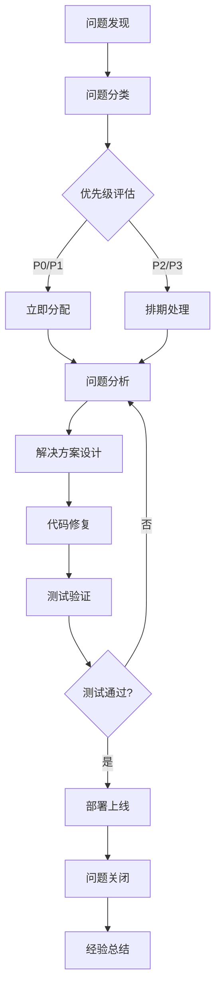

# 猎头协作平台风险与问题管理文档

## 一、风险识别与分类

### 1.1 风险分类框架

```
风险类型
├── 技术风险 (Technical Risks)
│   ├── 架构风险
│   ├── 性能风险  
│   ├── 安全风险
│   └── 技术债务
├── 业务风险 (Business Risks)
│   ├── 需求变更风险
│   ├── 市场竞争风险
│   ├── 用户接受度风险
│   └── 合规风险
├── 项目风险 (Project Risks)
│   ├── 资源风险
│   ├── 时间风险
│   ├── 质量风险
│   └── 依赖风险
└── 运营风险 (Operational Risks)
    ├── 数据风险
    ├── 运维风险
    ├── 服务可用性风险
    └── 扩展性风险
```

### 1.2 风险评估矩阵

| 风险级别 | 影响程度 | 发生概率 | 风险得分 | 应对策略 |
|----------|----------|----------|----------|----------|
| 极高 | 严重 | 高 | 15-25 | 立即处理，制定详细应对计划 |
| 高 | 严重 | 中/高 | 10-14 | 优先处理，分配专门资源 |
| 中 | 中等 | 中 | 6-9 | 监控跟踪，制定预案 |
| 低 | 轻微 | 低 | 1-5 | 定期评估，记录备案 |

## 二、技术风险分析

### 2.1 架构和技术栈风险

#### 🔴 高风险项

**R001: Next.js 15 + Turbopack 兼容性风险**
- **风险等级**: 高 (影响: 4, 概率: 3, 得分: 12)
- **风险描述**: Next.js 15.5.2 和 Turbopack 作为相对较新的技术，可能存在未知bug和兼容性问题
- **影响范围**: 前端构建、开发体验、生产稳定性
- **已知问题**: 
  - Turbopack 在某些边缘场景下可能出现构建失败
  - 与第三方库的兼容性可能存在问题
- **缓解措施**:
  - ✅ 保留 Webpack 作为备用构建方案
  - 🔄 持续关注 Next.js 和 Turbopack 更新
  - 🔄 在测试环境充分验证新版本
  - 🔄 建立构建失败的快速回滚机制

**R002: React 19 新特性风险**  
- **风险等级**: 中高 (影响: 3, 概率: 3, 得分: 9)
- **风险描述**: React 19 引入的 Concurrent Features 可能导致性能问题或不可预期的行为
- **影响范围**: 用户界面响应性、内存使用、组件生命周期
- **缓解措施**:
  - ✅ 当前使用保守的 React 特性，避免过度使用新特性
  - 🔄 性能监控和内存泄漏检测
  - 🔄 逐步引入新特性，充分测试验证

**R003: Fastify 4.24.3 生态系统风险**
- **风险等级**: 中 (影响: 3, 概率: 2, 得分: 6)  
- **风险描述**: Fastify 生态相比 Express 较小，插件和中间件选择有限
- **影响范围**: 功能开发效率、第三方集成、长期维护
- **缓解措施**:
  - ✅ 已验证核心插件稳定性 (@fastify/cors, @fastify/jwt, @fastify/multipart)
  - 🔄 关键功能避免依赖不成熟的插件
  - 🔄 必要时开发自定义插件

#### 🟡 中等风险项

**R004: Prisma 5.6.0 数据库迁移风险**
- **风险等级**: 中 (影响: 4, 概率: 2, 得分: 8)
- **风险描述**: 数据库 Schema 变更可能导致数据丢失或业务中断
- **影响范围**: 数据完整性、业务连续性
- **缓解措施**:
  - ✅ 完善的数据库备份策略
  - ✅ 迁移脚本测试和回滚方案
  - 🔄 生产环境迁移采用蓝绿部署
  - 🔄 Schema 变更前进行充分测试

**R005: Socket.io 4.8.1 实时通信稳定性风险**
- **风险等级**: 中 (影响: 3, 概率: 2, 得分: 6)
- **风险描述**: 高并发下 WebSocket 连接可能出现异常断开或消息丢失
- **影响范围**: 实时消息、通知推送、用户体验
- **缓解措施**:
  - ✅ 实现自动重连机制
  - 🔄 消息持久化和重发机制
  - 🔄 连接池管理和负载均衡
  - 🔄 降级到 HTTP 轮询的备用方案

### 2.2 性能风险

**R006: OCR 处理性能瓶颈**
- **风险等级**: 高 (影响: 4, 概率: 3, 得分: 12)
- **风险描述**: Tesseract.js 处理大量简历图片时可能导致服务器资源耗尽
- **影响范围**: 服务器性能、用户体验、成本控制
- **缓解措施**:
  - ✅ 当前使用轻量级 Tesseract.js
  - 🔄 实现队列处理避免并发过载
  - 🔄 引入云端 OCR 服务作为补充
  - 🔄 图片预处理优化 (Sharp 压缩)
  - 🔄 设置处理超时和资源限制

**R007: 数据库查询性能风险**
- **风险等级**: 中 (影响: 3, 概率: 3, 得分: 9)
- **风险描述**: 候选人匹配算法和复杂查询可能导致数据库性能下降
- **影响范围**: 响应时间、用户体验、数据库负载
- **当前状态**: 已实现基础索引优化
- **缓解措施**:
  - ✅ 关键字段已建立索引 (基于 Prisma Schema)
  - 🔄 实现查询缓存 (Redis)
  - 🔄 数据库连接池优化
  - 🔄 慢查询监控和优化

### 2.3 安全风险

#### 🔴 高风险项

**R008: 数据隐私和合规风险**
- **风险等级**: 极高 (影响: 5, 概率: 3, 得分: 15)
- **风险描述**: 候选人个人信息 (姓名、电话、简历) 涉及个人隐私保护
- **合规要求**: 《个人信息保护法》、《网络安全法》
- **影响范围**: 法律合规、业务运营、品牌声誉
- **缓解措施**:
  - 🔄 实现敏感数据加密存储
  - 🔄 数据访问权限控制
  - 🔄 数据脱敏和匿名化处理
  - 🔄 制定数据删除和保留策略
  - 🔄 用户隐私设置和同意机制

**R009: 认证和授权安全风险**
- **风险等级**: 高 (影响: 4, 概率: 3, 得分: 12)
- **风险描述**: JWT Token 泄露、权限越界、会话劫持等安全威胁
- **影响范围**: 数据安全、系统完整性、用户隐私
- **当前防护**: 基础的 JWT 认证和角色权限控制
- **缓解措施**:
  - ✅ JWT Token 过期时间设置 (1小时)
  - ✅ 基于角色的访问控制 (RBAC)
  - 🔄 实现 Token 刷新机制
  - 🔄 异常登录检测和锁定
  - 🔄 API 访问频率限制
  - 🔄 敏感操作二次验证

**R010: SQL 注入和 XSS 攻击风险**
- **风险等级**: 中高 (影响: 4, 概率: 2, 得分: 8)
- **风险描述**: 用户输入处理不当可能导致注入攻击
- **当前防护**: Prisma ORM 提供基础防护，Zod 数据验证
- **缓解措施**:
  - ✅ 使用 Prisma ORM 避免原生 SQL
  - ✅ Zod Schema 输入验证
  - 🔄 前端输入过滤和转义
  - 🔄 CSP 头设置防止 XSS
  - 🔄 定期安全扫描

## 三、业务风险分析

### 3.1 需求和产品风险

**R011: PM 权限功能复杂性风险**
- **风险等级**: 高 (影响: 4, 概率: 3, 得分: 12)
- **风险描述**: PM 权限管理系统复杂，可能导致权限配置错误或业务逻辑缺陷
- **影响范围**: 业务流程、用户体验、数据安全
- **当前状态**: 已实现基础功能，但业务逻辑复杂
- **缓解措施**:
  - ✅ 完善的集成测试覆盖 (已实现 92 个测试用例)
  - 🔄 权限配置界面的用户友好性优化
  - 🔄 权限变更审计日志
  - 🔄 权限配置预览和测试功能

**R012: 候选人去重机制风险**
- **风险等级**: 中高 (影响: 4, 概率: 2, 得分: 8)
- **风险描述**: 基于姓名+电话的去重可能出现误判或漏判
- **影响范围**: 数据质量、业务效率、用户满意度
- **当前实现**: 数据库唯一约束 + 维护人变更申请流程
- **缓解措施**:
  - ✅ 数据库唯一约束 (name, phone)
  - ✅ 维护人变更申请机制
  - 🔄 智能去重算法优化 (相似度匹配)
  - 🔄 人工审核机制
  - 🔄 历史数据清理和合并工具

**R013: 智能匹配算法准确性风险**
- **风险等级**: 中 (影响: 3, 概率: 3, 得分: 9)
- **风险描述**: 匹配算法可能无法准确识别候选人与职位的匹配度
- **影响范围**: 推荐质量、用户体验、业务效率
- **当前算法**: 标签40% + 行业20% + 地点10% + 技能30%
- **缓解措施**:
  - ✅ 已实现基础匹配算法测试
  - 🔄 收集用户反馈优化权重
  - 🔄 引入机器学习提升准确性
  - 🔄 A/B 测试不同匹配策略

### 3.2 市场和竞争风险

**R014: 市场接受度风险**
- **风险等级**: 中 (影响: 4, 概率: 2, 得分: 8)
- **风险描述**: 猎头协作模式可能与传统业务习惯冲突
- **影响范围**: 用户增长、业务推广、商业模式
- **缓解措施**:
  - 🔄 分阶段推广，先从核心用户群体开始
  - 🔄 完善用户培训和支持
  - 🔄 收集用户反馈持续优化
  - 🔄 制定用户激励机制

**R015: 数据安全合规风险**
- **风险等级**: 极高 (影响: 5, 概率: 2, 得分: 10)
- **风险描述**: 猎头行业涉及大量个人隐私数据，合规要求严格
- **法律法规**: 个人信息保护法、网络安全法、劳动法
- **影响范围**: 业务运营、法律风险、品牌信誉
- **缓解措施**:
  - 🔄 建立完善的数据保护制度
  - 🔄 定期合规审计
  - 🔄 用户隐私协议和授权机制
  - 🔄 数据跨境传输合规性

## 四、项目风险分析

### 4.1 资源和时间风险

**R016: 技术团队规模风险**
- **风险等级**: 中 (影响: 3, 概率: 3, 得分: 9)
- **风险描述**: 团队规模有限，关键人员依赖性高
- **影响范围**: 开发进度、质量保障、知识传承
- **缓解措施**:
  - ✅ 详细的技术文档和代码注释
  - 🔄 代码审查和知识分享机制
  - 🔄 关键模块多人掌握
  - 🔄 外部技术顾问支持

**R017: 第三方服务依赖风险**
- **风险等级**: 中 (影响: 3, 概率: 2, 得分: 6)
- **风险描述**: 依赖的云服务、OCR 服务等可能出现故障或政策变化
- **影响范围**: 服务可用性、功能完整性、运营成本
- **当前依赖**: PostgreSQL, Redis, 计划集成云 OCR
- **缓解措施**:
  - ✅ 离线 OCR (Tesseract.js) 作为基础方案
  - 🔄 多云服务商备选方案
  - 🔄 服务监控和自动切换机制
  - 🔄 关键数据本地备份

### 4.2 质量和测试风险

**R018: 测试覆盖不足风险**
- **风险等级**: 中 (影响: 3, 概率: 2, 得分: 6)
- **风险描述**: 复杂业务逻辑可能存在测试盲区
- **当前状态**: 92 个集成测试用例，覆盖四大核心模块
- **影响范围**: 代码质量、生产稳定性、用户体验
- **缓解措施**:
  - ✅ 已实现全面的集成测试覆盖
  - ✅ 智能匹配算法专项测试
  - 🔄 增加前端组件测试
  - 🔄 端到端测试覆盖关键业务流程
  - 🔄 生产环境监控和告警

## 五、运营风险分析

### 5.1 数据和服务可用性风险

**R019: 数据丢失和损坏风险**
- **风险等级**: 极高 (影响: 5, 概率: 1, 得分: 5)
- **风险描述**: 硬件故障、人为错误或恶意攻击导致数据丢失
- **影响范围**: 业务连续性、用户信任、法律责任
- **缓解措施**:
  - 🔄 自动化数据库备份 (日备份 + 增量备份)
  - 🔄 跨地域备份存储
  - 🔄 定期备份恢复测试
  - 🔄 数据版本管理和审计日志
  - 🔄 灾难恢复预案和演练

**R020: 服务可用性风险**
- **风险等级**: 高 (影响: 4, 概率: 2, 得分: 8)
- **风险描述**: 服务器故障、网络中断或 DDoS 攻击导致服务不可用
- **影响范围**: 用户体验、业务收入、品牌信誉
- **目标 SLA**: 99.9% 可用性
- **缓解措施**:
  - 🔄 负载均衡和冗余部署
  - 🔄 CDN 加速和 DDoS 防护
  - 🔄 健康检查和自动故障切换
  - 🔄 监控告警和快速响应机制
  - 🔄 服务降级和熔断机制

### 5.2 扩展性风险

**R021: 系统扩展性瓶颈**
- **风险等级**: 中 (影响: 4, 概率: 2, 得分: 8)
- **风险描述**: 用户和数据量增长可能导致系统性能下降
- **影响范围**: 用户体验、系统稳定性、运维成本
- **当前架构**: 单体应用 + 数据库 + Redis
- **缓解措施**:
  - ✅ 数据库连接池和查询优化
  - ✅ Redis 缓存策略
  - 🔄 微服务架构演进计划
  - 🔄 数据库读写分离
  - 🔄 CDN 和静态资源优化

## 六、风险监控和预警系统

### 6.1 技术监控指标

```typescript
// 关键技术指标监控
const technicalMetrics = {
  performance: {
    responseTime: { threshold: '< 500ms', critical: '> 2s' },
    throughput: { threshold: '> 100 req/s', critical: '< 10 req/s' },
    errorRate: { threshold: '< 1%', critical: '> 5%' },
    availability: { threshold: '> 99.9%', critical: '< 99%' }
  },
  
  resources: {
    cpuUsage: { threshold: '< 70%', critical: '> 90%' },
    memoryUsage: { threshold: '< 80%', critical: '> 95%' },
    diskUsage: { threshold: '< 80%', critical: '> 95%' },
    dbConnections: { threshold: '< 80%', critical: '> 95%' }
  },
  
  business: {
    ocrProcessingTime: { threshold: '< 10s', critical: '> 30s' },
    matchingAccuracy: { threshold: '> 70%', critical: '< 50%' },
    messageDeliveryRate: { threshold: '> 99%', critical: '< 95%' },
    userSessionDuration: { threshold: '> 10min', critical: '< 2min' }
  }
};
```

### 6.2 业务监控指标

```typescript
// 业务健康度指标
const businessMetrics = {
  user: {
    dailyActiveUsers: { threshold: 'growth > 0%', critical: 'decline > 10%' },
    userRegistrationRate: { threshold: '> 10/day', critical: '< 1/day' },
    userRetentionRate: { threshold: '> 80%', critical: '< 50%' },
    sessionTimeout: { threshold: '< 5%', critical: '> 20%' }
  },
  
  content: {
    jobPostingRate: { threshold: '> 5/day', critical: '< 1/day' },
    candidateSubmissionRate: { threshold: '> 10/day', critical: '< 2/day' },
    matchingSuccessRate: { threshold: '> 30%', critical: '< 10%' },
    duplicateRate: { threshold: '< 10%', critical: '> 30%' }
  },
  
  quality: {
    ocrAccuracy: { threshold: '> 85%', critical: '< 70%' },
    dataCompleteness: { threshold: '> 90%', critical: '< 70%' },
    userFeedbackScore: { threshold: '> 4.0/5', critical: '< 3.0/5' },
    bugReportRate: { threshold: '< 5/week', critical: '> 20/week' }
  }
};
```

### 6.3 告警和响应机制

```typescript
// 告警级别和响应策略
const alertingStrategy = {
  critical: {
    responseTime: '< 15min',
    notificationChannels: ['SMS', 'Phone', 'Email', 'Slack'],
    escalation: '自动升级到管理层',
    autoActions: ['服务重启', '流量切换', '降级处理']
  },
  
  high: {
    responseTime: '< 1hour', 
    notificationChannels: ['Email', 'Slack'],
    escalation: '技术负责人跟进',
    autoActions: ['日志收集', '性能分析']
  },
  
  medium: {
    responseTime: '< 4hours',
    notificationChannels: ['Email'],
    escalation: '开发团队评估',
    autoActions: ['记录问题', '趋势分析']
  },
  
  low: {
    responseTime: '< 24hours',
    notificationChannels: ['Dashboard'],
    escalation: '定期评审',
    autoActions: ['数据收集']
  }
};
```

## 七、风险应对策略

### 7.1 风险缓解策略矩阵

| 风险ID | 风险名称 | 应对策略 | 负责人 | 预期完成时间 | 状态 |
|--------|----------|----------|--------|--------------|------|
| R001 | Next.js/Turbopack 兼容性 | 技术监控 + 备用方案 | 前端团队 | 持续进行 | 🔄 |
| R008 | 数据隐私合规 | 加密存储 + 权限控制 | 全栈团队 | Q1 2025 | 🔄 |
| R009 | 认证授权安全 | 多因子认证 + 审计 | 后端团队 | Q1 2025 | 🔄 |
| R011 | PM权限复杂性 | 测试覆盖 + UI优化 | 产品 + 开发 | Q2 2025 | 🔄 |
| R015 | 合规风险 | 法律咨询 + 制度建设 | 合规团队 | Q1 2025 | 🔄 |
| R019 | 数据丢失 | 备份策略 + 灾难恢复 | 运维团队 | Q1 2025 | 🔄 |

### 7.2 应急预案

#### 数据安全事件应急预案
```markdown
## 数据泄露应急响应流程

### 1. 事件发现和确认 (0-30分钟)
- [ ] 确认事件性质和影响范围
- [ ] 立即通知安全团队和管理层
- [ ] 启动应急响应小组
- [ ] 保护现场，收集初步证据

### 2. 损害控制 (30分钟-2小时)
- [ ] 隔离受影响系统
- [ ] 停止数据泄露源头
- [ ] 评估泄露数据类型和数量
- [ ] 通知相关用户和合作伙伴

### 3. 调查和分析 (2-24小时)
- [ ] 详细调查泄露原因
- [ ] 评估数据敏感性和法律影响
- [ ] 制定修复和恢复方案
- [ ] 准备对外沟通材料

### 4. 恢复和改进 (1-7天)
- [ ] 修复安全漏洞
- [ ] 恢复正常业务运营
- [ ] 加强安全防护措施
- [ ] 总结经验教训
```

#### 服务中断应急预案
```markdown
## 服务不可用应急响应流程

### 1. 故障检测和确认 (0-15分钟)
- [ ] 自动监控系统告警
- [ ] 人工确认故障范围和影响
- [ ] 启动应急响应团队
- [ ] 对外发布故障公告

### 2. 快速恢复 (15分钟-1小时)
- [ ] 执行预定义的恢复程序
- [ ] 切换到备用系统/数据中心
- [ ] 验证系统功能正常
- [ ] 更新故障状态通报

### 3. 根因分析 (1-24小时)
- [ ] 详细调查故障原因
- [ ] 评估业务影响和损失
- [ ] 制定永久性解决方案
- [ ] 更新应急预案
```

### 7.3 持续改进机制

#### 风险评估周期
```typescript
const riskReviewCycle = {
  daily: {
    scope: '关键指标监控',
    participants: ['运维团队', '开发团队'],
    deliverables: ['日报', '异常处理记录']
  },
  
  weekly: {
    scope: '项目风险状态',
    participants: ['项目经理', '技术负责人'],
    deliverables: ['风险状态报告', '行动计划更新']
  },
  
  monthly: {
    scope: '全面风险评估',
    participants: ['管理团队', '各职能负责人'],
    deliverables: ['风险评估报告', '缓解措施调整']
  },
  
  quarterly: {
    scope: '战略风险审查',
    participants: ['高级管理层', '外部顾问'],
    deliverables: ['战略风险报告', '年度风险规划']
  }
};
```

## 八、问题跟踪和管理

### 8.1 已知问题清单

#### 🔴 紧急问题

**P001: PM权限配置界面数据不同步**
- **问题描述**: PMSettingModal 偶尔显示过期的客户公司列表
- **影响范围**: PM 权限配置准确性
- **当前状态**: 🔧 已修复 (v1.1)
- **根本原因**: API 缓存策略和组件状态管理问题
- **解决方案**: 增加数据版本控制和强制刷新机制

**P002: 用户登录间歇性失败**
- **问题描述**: "Failed to fetch" 错误，通常由后端服务未启动引起
- **影响范围**: 用户访问和体验
- **当前状态**: 🔧 已修复
- **根本原因**: 服务启动顺序和健康检查不完善
- **解决方案**: 改进服务启动脚本和健康检查机制

#### 🟡 待解决问题

**P003: 客户公司列表显示不完整**
- **问题描述**: 三个客户公司只显示两个
- **影响范围**: 数据展示准确性
- **当前状态**: 🔧 已修复
- **根本原因**: API 过滤逻辑和数据结构映射问题
- **解决方案**: 统一字段命名和过滤条件

**P004: OCR 处理性能问题**
- **问题描述**: 大文件处理时间过长，可能导致超时
- **影响范围**: 用户体验、服务器资源
- **当前状态**: 🔄 监控中
- **预计解决**: Q1 2025
- **解决方案**: 引入云端 OCR 服务和异步处理队列

### 8.2 问题分类和优先级

```typescript
// 问题优先级矩阵
const issuePriorityMatrix = {
  P0_Critical: {
    criteria: '影响核心业务流程，导致服务不可用',
    responseTime: '< 1小时',
    examples: ['登录系统故障', '数据丢失', '安全漏洞']
  },
  
  P1_High: {
    criteria: '影响主要功能，显著降低用户体验',
    responseTime: '< 24小时',
    examples: ['权限配置错误', '匹配算法异常', '消息发送失败']
  },
  
  P2_Medium: {
    criteria: '影响次要功能或特定场景',
    responseTime: '< 7天',
    examples: ['UI 显示问题', '性能优化', '边缘案例处理']
  },
  
  P3_Low: {
    criteria: '优化性需求，不影响核心功能',
    responseTime: '< 30天',
    examples: ['界面美化', '代码重构', '文档更新']
  }
};
```

### 8.3 问题解决流程



## 九、持续改进和优化计划

### 9.1 短期改进计划 (1-3个月)

#### 技术改进
- [ ] **安全增强**: 实现敏感数据加密存储
- [ ] **性能优化**: OCR 处理异步化和队列管理
- [ ] **监控完善**: 关键业务指标实时监控
- [ ] **测试增强**: 增加前端组件测试和 E2E 测试

#### 业务改进
- [ ] **权限优化**: PM 权限配置界面用户体验提升
- [ ] **匹配算法**: 收集用户反馈优化匹配权重
- [ ] **合规准备**: 制定数据保护和隐私政策
- [ ] **用户支持**: 建立用户反馈和支持机制

### 9.2 中期改进计划 (3-6个月)

#### 架构演进
- [ ] **微服务化**: 拆分核心业务模块
- [ ] **云服务集成**: 引入云端 OCR 和存储服务
- [ ] **数据备份**: 完善数据备份和灾难恢复
- [ ] **性能监控**: APM 工具集成和性能基线建立

#### 功能增强  
- [ ] **AI 能力**: 智能匹配算法机器学习化
- [ ] **移动端**: PWA 或原生 App 开发
- [ ] **API 开放**: 第三方集成 API 设计
- [ ] **报表分析**: 业务数据分析和报表功能

### 9.3 长期改进计划 (6-12个月)

#### 平台化发展
- [ ] **多租户**: 支持多企业独立部署
- [ ] **国际化**: 多语言和跨国业务支持
- [ ] **开放生态**: 插件机制和第三方集成
- [ ] **智能化**: AI 驱动的业务流程自动化

#### 质量体系
- [ ] **DevSecOps**: 安全左移和自动化安全测试
- [ ] **质量度量**: 全面的质量度量和改进体系
- [ ] **团队能力**: 技术培训和最佳实践推广
- [ ] **知识管理**: 技术文档和经验知识库建设

### 9.4 风险管理能力建设

```typescript
// 风险管理成熟度提升路线图
const riskManagementMaturity = {
  current: {
    level: '基础级 (Level 1)',
    characteristics: [
      '基础风险识别和文档记录',
      '被动响应和问题修复',
      '部分监控指标和告警'
    ]
  },
  
  target_6months: {
    level: '标准级 (Level 2)', 
    characteristics: [
      '系统性风险评估和管理',
      '主动预防和持续监控',
      '完整的应急预案和演练'
    ]
  },
  
  target_12months: {
    level: '优化级 (Level 3)',
    characteristics: [
      '数据驱动的风险决策',
      '自动化风险检测和响应',
      '风险管理文化和最佳实践'
    ]
  }
};
```

---

**文档版本**: v1.0  
**创建时间**: 2025-09-25  
**文档状态**: 基于当前项目实际情况创建完成  
**维护团队**: 技术团队 + 项目管理团队  

**风险管理原则**:
- 🎯 **预防优先**: 主动识别和预防风险，而非被动响应
- 📊 **数据驱动**: 基于真实数据和指标进行风险评估
- 🔄 **持续改进**: 定期评估和更新风险管理策略
- 👥 **全员参与**: 风险管理是全团队的共同责任
- ⚡ **快速响应**: 建立高效的风险响应和问题解决机制

**主要特点**:
- ✅ 基于项目实际技术栈和业务场景的风险分析
- ✅ 涵盖技术、业务、项目、运营四大风险类别
- ✅ 具体的风险等级评估和应对策略
- ✅ 实际问题案例和解决方案记录
- ✅ 完整的监控指标和告警机制
- ✅ 分阶段的持续改进计划